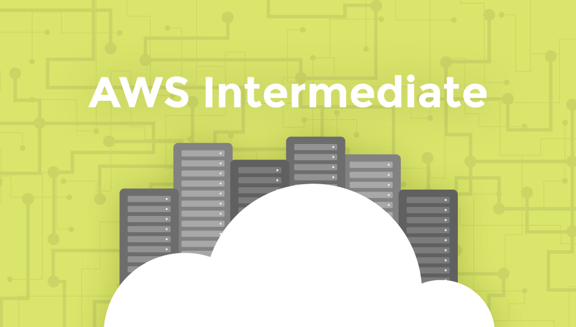
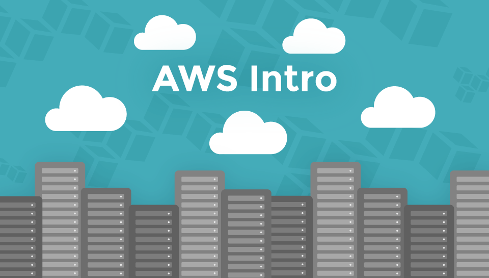

footer: © NodeProgram.com, Node.University and Azat Mardan
theme: Simple, 1
build-lists: true

[.slidenumbers: false]
[.hide-footer]

---

# AWS Intermediate
## Overview

Azat Mardan @azat_co

---

# Meet Your Instructor

* Name: Azat Mardan
* Author of 14 books and over 12 online courses, taught over 500 engineers in-person and over 25,000 online (Udemy and Node University)
* Works as Capital One Technology Fellow (modeled after IBM and Google Fellows)

---

---

# Meet Your Instructor (cont)

* Master of Science in Information Systems Technology from University of Northern Virginia (2007)
* Working on my second Master's degree, this time in Software Engineering and from Harvard University
* Twitter: @azat_co, Online: <http://azat.co>

---

# Why I teach this course?

My experience with cloud

* Gizmo: small startup, used Rackspace
* Storify: small startup, used Joyent and AWS
* DocuSign: didn't use cloud 😞
* Capital One: cloud everywhere

---

# Introduce yourself by raising your hand ✋

* How many years in technology, 1, 2, 4, 8, 16?
* Your main language, Java, Python, Ruby, C, JavaScript, COBOL?
* What is your expectation so that you are 100% satisfied by this course at 5pm?

---

# Turn off your IMs, Slack, Hipchat, email, phones... seriously

Multitasking does NOT work (for work which requires focus)[^1]

[^1]: https://blog.codinghorror.com/the-multi-tasking-myth, http://amzn.to/2ojSBzx and http://amzn.to/2oTZSDU

---

# Process

* Lectures
* Demos and lab demos
* Hands-on labs with lab documents

---

# Slides, Lab Docs and Code

* Slides are often just talking points
* Lab docs have detailed step by step walk-throughs
* Code  (`code` folder) has all scripts - use them for accuracy

PS: You'll download all this courseware soon in Lab 0 / Pre-requisites

^because reading from slides is boring so pay attention and take notes!

---

# General questions

Example: *How CloudFormation is different from OpsWorks?*

Google first, if it takes more than 3 min to find the answer then ask in the comments section or on NodeU Slack.

---

# Specific questions

Example: *Why XYZ is not working on my computer!?*

Google and search on Stackovreflow first, then ask in the comments section or on the azat-co/aws-intermediate GitHub,  or on NodeU Slack.

---

# Table of Contents

---

# Module 1: DevOps Principles

* DevOps and Infrastructure as code
* Identity Access Management in AWS
* Best IAM Practices
* Configuring access with AWS CLI
* Working with AWS CLI
* Lab 1: Install AWS CLI, configure, create an instance

---

# Module 2: AWS SDKs

* Advantages of AWS SDKs
* Configuring access with Node SDK
* Node SDK Example
* Lab 2: Write a Node script to create an instance and run it

---

# Module 3: Cloud Infrastructure Automation with CloudFormation

* CloudFormation (CF) advantage
* CF structure: Parameters, Resources, Mapping and other
* CF functions
* Lab 3: Create an ELB and auto scaling environment from CloudFormation template/blueprint

---

# Module 4: Building CI/CD

* CI/CD Workflow
* CodeDeploy
* CodePipeline
* Lab 4: Build CI with CodeDeploy, CodePipeline and GitHub

---

# Module 5: AWS Databases

* Overview of RDS, DynamoDB and other services

---

# Module 6: PaaS and Containers

* Overview of AWS Elastic Beanstalk
* Overview of Docker in AWS: EC2, ECS and Elastic Beanstalk Containers

---

# Module 7: Serverless with AWS Lambda

* AWS Lambda use cases and benefits
* Lab 5: Create a lambda CRUD microservice to CRUD data in DynamoDB

---

## Outro

* Summary
* AWS Events
* AWS Certifications
* AWS Books
* AWS Courses

---

# Quickly Summary of AWS Intro

<https://node.university/p/aws-intro>

---

## AWS Intro Topics Covered

* Cloud and AWS Basics
* Launching EC2
* Environment and App Deploy Automation
* Networking
* S3
* Auto Scaling
