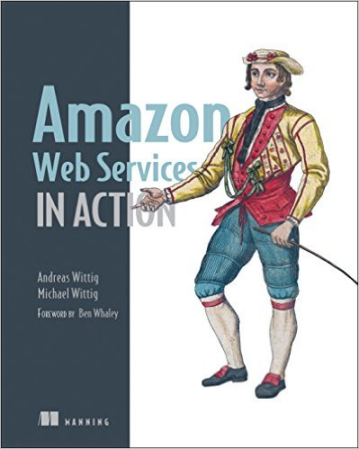
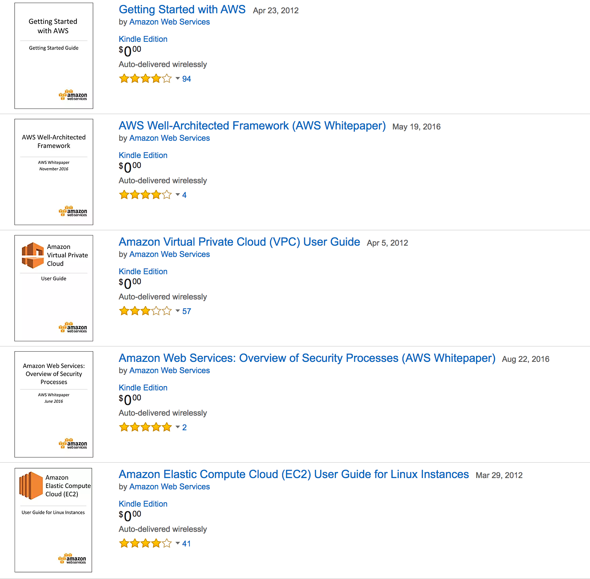
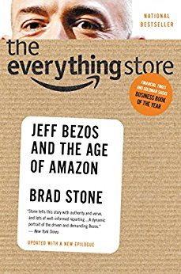
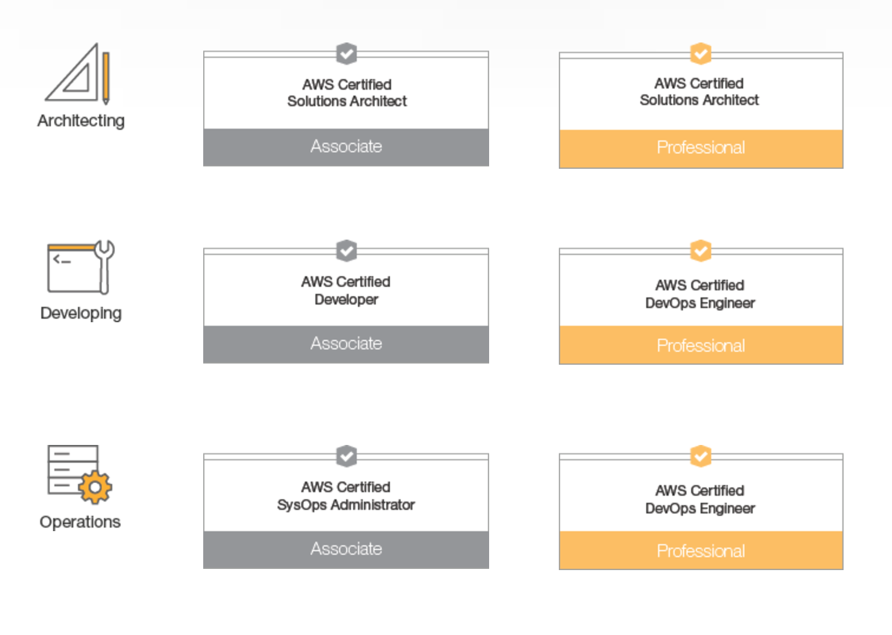
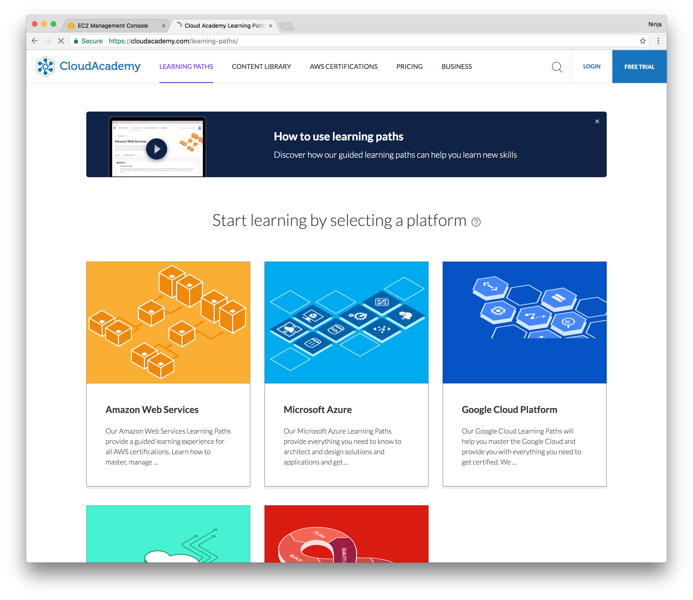
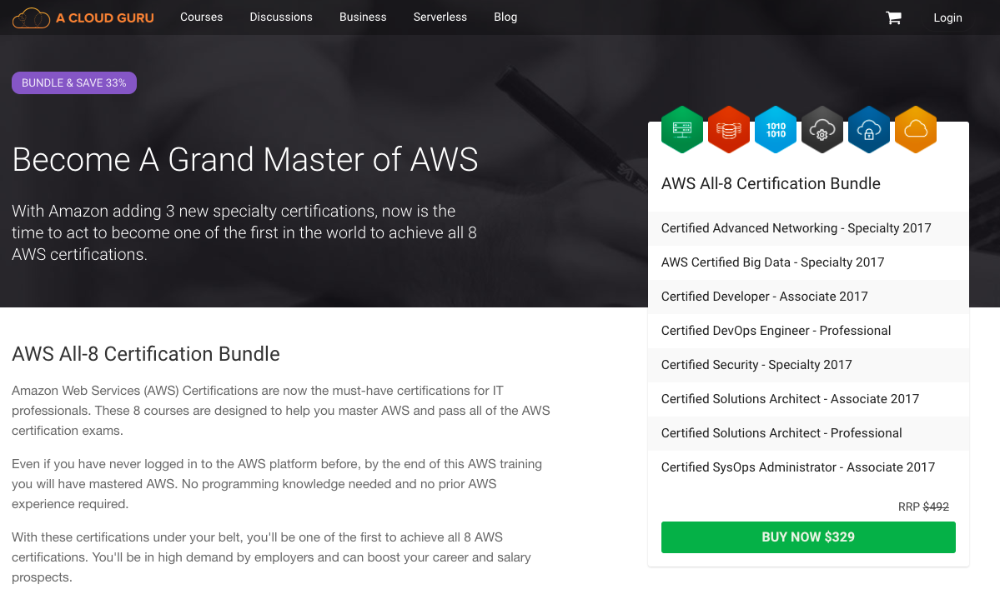
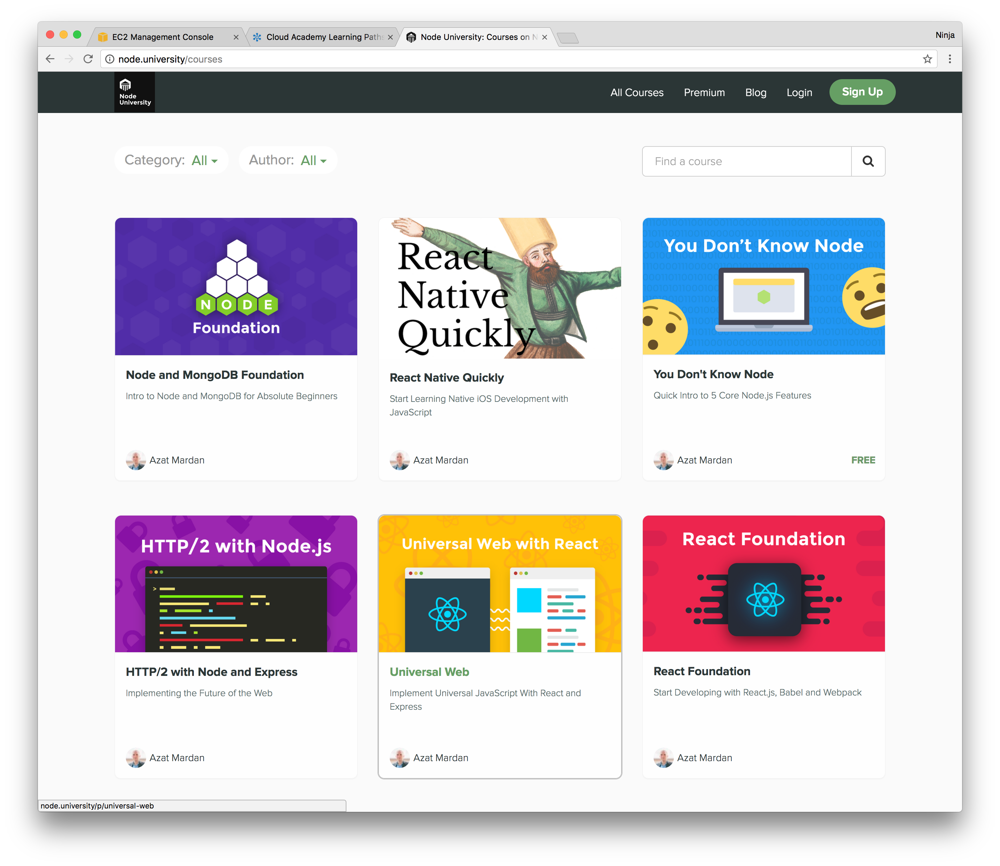

footer: © NodeProgram.com, Node.University and Azat Mardan
slidenumbers: true
theme: Simple, 1
build-lists: true

# AWS Intermediate
## Outro

Azat Mardan [@azatmardan](https://twitter.com/azatmardan)

---

# Summary

---

## Topics covered

* Well-architectured framework, IAM, AWS CLI and infrastructure as code
* Node SDK, CloudFormation and User Data to automate
* CodeDeploy and CodePipeline for CI/CD
* DynamoDB
* How to leverage AWS Lambda and API Gateway

---

## Labs covered

1. Hello World AWS CLI
1. SDK
1. CloudFormation
1. CodeDeploy and CodePipeline
1. Serverless and DynamoDB

---

# Further Study

---

# AWS Books

---

## [Amazon Web Services in Action](http://amzn.to/2o20OGf)

---

## [FREE AWS ebook and whitepapers](http://amzn.to/2nIpQIP)

---

## [The Everything Store: Jeff Bezos and the Age of Amazon ](http://amzn.to/2nhx4YI)

---

# AWS Events

* [AWS re:Invent 2017](https://reinvent.awsevents.com)
* [AWS Global Summits 2017](https://aws.amazon.com/summits)
* [AWS Global Class Schedule](https://www.aws.training/home)
* [AWS Training and Certification](https://aws.amazon.com/training/)

---

# AWS Certifications

---

# AWS official resources

* [Try AWS with 10-Minute Tutorials](https://aws.amazon.com/start-now)
* [Documentation](https://aws.amazon.com/documentation)
* [YouTube channel](https://www.youtube.com/channel/UCd6MoB9NC6uYN2grvUNT-Zg)
* [Week in Review](https://aws.amazon.com/blogs/aws/category/week-in-review)

---

# AWS Courses

---

---

---

---

# Take Node in Production for more Docker and AWS ECS

<https://node.university/p/node-in-production>

---

# The End 🔚🏁👏
