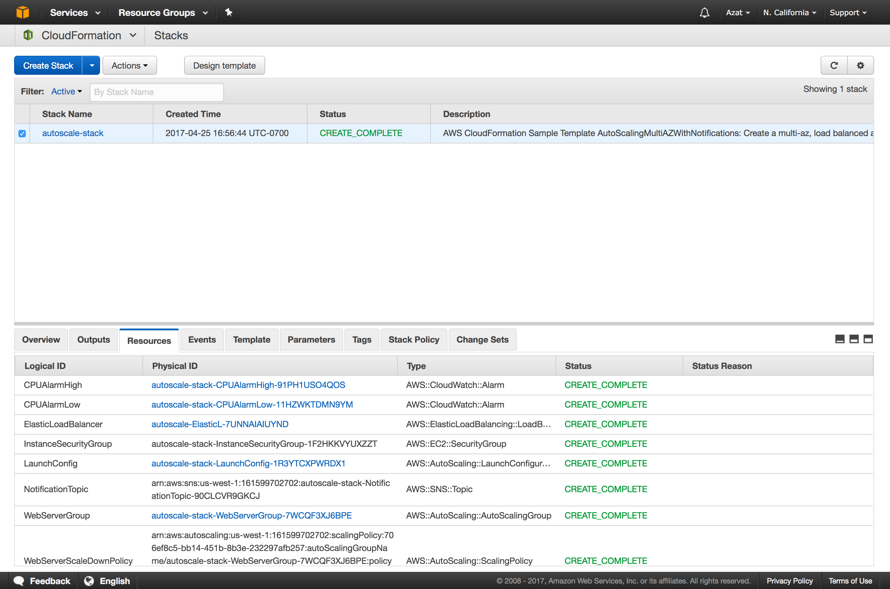
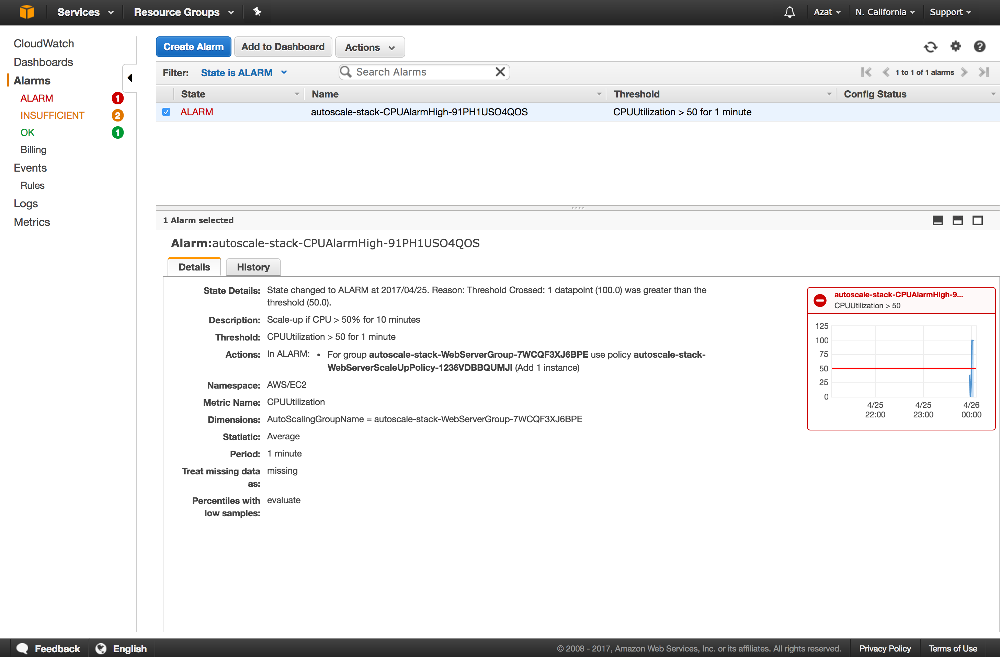
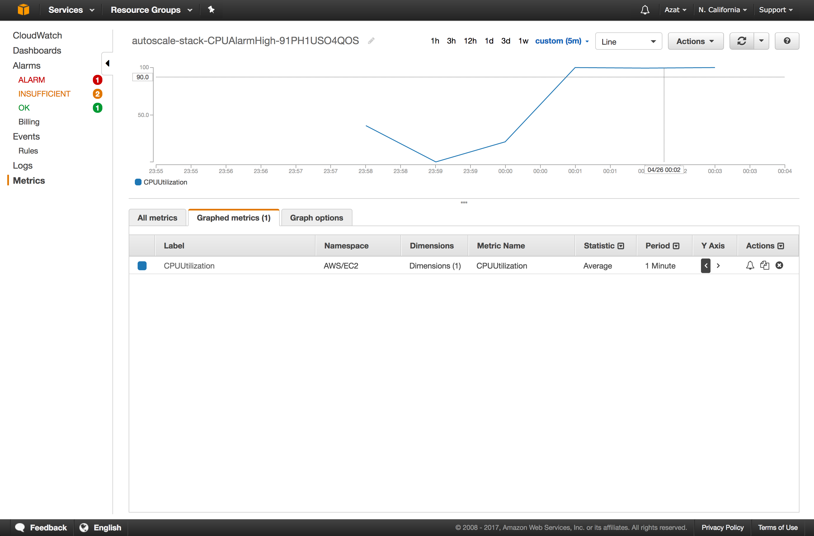
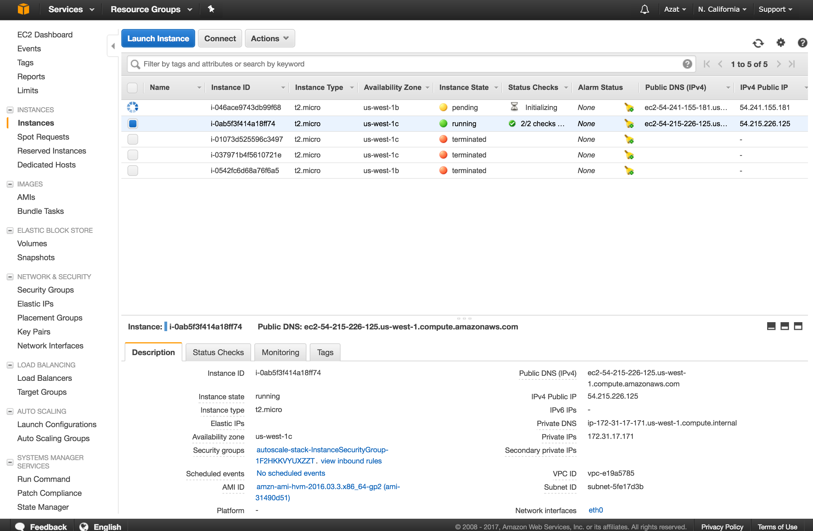

# Lab 3: Form the Cloud ☁️

Autoscaling group is one of the pillars of the AWS well-architectured framework— reliability. With autoscaling group, you can set up alarm on metrics (CPU, memory, app metrics, etc.) to handle the load or decrease  to save on cost. For example, you will have Elastic Load Balancer, 2 or 3 instances in different Availability Zones, Launch Configuration and Autoscaling group with policies and alarms... many various parts to set up.

If you've ever tried to set up an autoscaling group in the AWS web console (one of the labs in [the AWS Intro course](https://github.com/azat-co/aws-intro)), that's a boatload of clicks. With every manual click, anything can go wrong.

Let's eliminate manual work and reduce any chance of mistakes by using Cloud Formation to launch an autoscaling group with an HTTP servers.

# Task

Create an ELB, security group and auto scaling environment from CloudFormation template/blueprint; load/stress test it to see auto increase.


# Walk-through

If you would like to attempt the task, then skip the walk-through and go for the task directly. However, if you need a little bit more hand holding or you would like to look up some of the commands or code or settings, then follow the walk-through.

1. Create a CloudFormation blueprint
1. Launch stack from blueprint
1. Install load testing tool
1. Load/Stress test the instances in the stack
1. Terminate stack

## 1. Create a CloudFormation Blueprint


Create a CF (CloudFormation) blueprint with autoscaling group or modify the blueprint in code/NodeAutoScalingMultiAZWithNotifications.json. In a nutshell, the provided blueprint uses the following parameters:

* InstanceType: Specify instance type
* OperatorEMail: Specify email to receive alarms
* KeyName: Specify SSH key pair name (must exist)
* SSHLocation: Specify origin IP of the SSH connections

The provided `NodeAutoScalingMultiAZWithNotifications.json` blueprint creates the following resources:

* NotificationTopic: Email notifications to OperatorEMail
* WebServerGroup: Define autoscaling group
* LaunchConfig: Define launch configuration including User Data to install and start the app
* WebServerScaleUpPolicy: Define how to scale up, e.g., cooldown period and number of instances to increase
* WebServerScaleDownPolicy:: Define how to scale down, e.g., cooldown period and number of instances to decrease
* CPUAlarmLow: Define a CPU alarm as more than 50% within 1 minute
* CPUAlarmHigh: Define a CPU alarm as less than 25% within 1 minute
* ElasticLoadBalancer: Define ELB with listener HTTP:80, cross zone and health check params
* InstanceSecurityGroup: Define security group with SSH:22 and HTTP:80 open


```js
{
  "AWSTemplateFormatVersion" : "2010-09-09",

  "Description" : "AWS CloudFormation Sample Template AutoScalingMultiAZWithNotifications: Create a multi-az, load balanced and Auto Scaled sample web site running on an Apache Web Serever. The application is configured to span all Availability Zones in the region and is Auto-Scaled based on the CPU utilization of the web servers. Notifications will be sent to the operator email address on scaling events. The instances are load balanced with a simple health check against the default web page. **WARNING** This template creates one or more Amazon EC2 instances and an Elastic Load Balancer. You will be billed for the AWS resources used if you create a stack from this template.",

  "Parameters" : {
    "InstanceType" : {
      "Description" : "WebServer EC2 instance type",
      "Type" : "String",
      "Default" : "t2.small",
      "AllowedValues" : [ "t1.micro", "t2.nano", "t2.micro", "t2.small", "t2.medium", "t2.large", "m1.small", "m1.medium", "m1.large", "m1.xlarge", "m2.xlarge", "m2.2xlarge", "m2.4xlarge", "m3.medium", "m3.large", "m3.xlarge", "m3.2xlarge", "m4.large", "m4.xlarge", "m4.2xlarge", "m4.4xlarge", "m4.10xlarge", "c1.medium", "c1.xlarge", "c3.large", "c3.xlarge", "c3.2xlarge", "c3.4xlarge", "c3.8xlarge", "c4.large", "c4.xlarge", "c4.2xlarge", "c4.4xlarge", "c4.8xlarge", "g2.2xlarge", "g2.8xlarge", "r3.large", "r3.xlarge", "r3.2xlarge", "r3.4xlarge", "r3.8xlarge", "i2.xlarge", "i2.2xlarge", "i2.4xlarge", "i2.8xlarge", "d2.xlarge", "d2.2xlarge", "d2.4xlarge", "d2.8xlarge", "hi1.4xlarge", "hs1.8xlarge", "cr1.8xlarge", "cc2.8xlarge", "cg1.4xlarge"]
,
      "ConstraintDescription" : "must be a valid EC2 instance type."
    },

    "OperatorEMail": {
      "Description": "EMail address to notify if there are any scaling operations",
      "Type": "String",
      "AllowedPattern": "([a-zA-Z0-9_\\-\\.]+)@((\\[[0-9]{1,3}\\.[0-9]{1,3}\\.[0-9]{1,3}\\.)|(([a-zA-Z0-9\\-]+\\.)+))([a-zA-Z]{2,4}|[0-9]{1,3})(\\]?)",
      "ConstraintDescription": "must be a valid email address."
    },

    "KeyName" : {
      "Description" : "The EC2 Key Pair to allow SSH access to the instances",
      "Type" : "AWS::EC2::KeyPair::KeyName",
      "ConstraintDescription" : "must be the name of an existing EC2 KeyPair."
    },

    "SSHLocation" : {
      "Description" : "The IP address range that can be used to SSH to the EC2 instances",
      "Type": "String",
      "MinLength": "9",
      "MaxLength": "18",
      "Default": "0.0.0.0/0",
      "AllowedPattern": "(\\d{1,3})\\.(\\d{1,3})\\.(\\d{1,3})\\.(\\d{1,3})/(\\d{1,2})",
      "ConstraintDescription": "must be a valid IP CIDR range of the form x.x.x.x/x."
    }
  },

  "Mappings" : {
    "AWSInstanceType2Arch" : {
      "t1.micro"    : { "Arch" : "PV64"   },
      "t2.nano"     : { "Arch" : "HVM64"  },
      "t2.micro"    : { "Arch" : "HVM64"  },
      "t2.small"    : { "Arch" : "HVM64"  },
      "t2.medium"   : { "Arch" : "HVM64"  },
      "t2.large"    : { "Arch" : "HVM64"  },
      "m1.small"    : { "Arch" : "PV64"   },
      "m1.medium"   : { "Arch" : "PV64"   },
      "m1.large"    : { "Arch" : "PV64"   },
      "m1.xlarge"   : { "Arch" : "PV64"   },
      "m2.xlarge"   : { "Arch" : "PV64"   },
      "m2.2xlarge"  : { "Arch" : "PV64"   },
      "m2.4xlarge"  : { "Arch" : "PV64"   },
      "m3.medium"   : { "Arch" : "HVM64"  },
      "m3.large"    : { "Arch" : "HVM64"  },
      "m3.xlarge"   : { "Arch" : "HVM64"  },
      "m3.2xlarge"  : { "Arch" : "HVM64"  },
      "m4.large"    : { "Arch" : "HVM64"  },
      "m4.xlarge"   : { "Arch" : "HVM64"  },
      "m4.2xlarge"  : { "Arch" : "HVM64"  },
      "m4.4xlarge"  : { "Arch" : "HVM64"  },
      "m4.10xlarge" : { "Arch" : "HVM64"  },
      "c1.medium"   : { "Arch" : "PV64"   },
      "c1.xlarge"   : { "Arch" : "PV64"   },
      "c3.large"    : { "Arch" : "HVM64"  },
      "c3.xlarge"   : { "Arch" : "HVM64"  },
      "c3.2xlarge"  : { "Arch" : "HVM64"  },
      "c3.4xlarge"  : { "Arch" : "HVM64"  },
      "c3.8xlarge"  : { "Arch" : "HVM64"  },
      "c4.large"    : { "Arch" : "HVM64"  },
      "c4.xlarge"   : { "Arch" : "HVM64"  },
      "c4.2xlarge"  : { "Arch" : "HVM64"  },
      "c4.4xlarge"  : { "Arch" : "HVM64"  },
      "c4.8xlarge"  : { "Arch" : "HVM64"  },
      "g2.2xlarge"  : { "Arch" : "HVMG2"  },
      "g2.8xlarge"  : { "Arch" : "HVMG2"  },
      "r3.large"    : { "Arch" : "HVM64"  },
      "r3.xlarge"   : { "Arch" : "HVM64"  },
      "r3.2xlarge"  : { "Arch" : "HVM64"  },
      "r3.4xlarge"  : { "Arch" : "HVM64"  },
      "r3.8xlarge"  : { "Arch" : "HVM64"  },
      "i2.xlarge"   : { "Arch" : "HVM64"  },
      "i2.2xlarge"  : { "Arch" : "HVM64"  },
      "i2.4xlarge"  : { "Arch" : "HVM64"  },
      "i2.8xlarge"  : { "Arch" : "HVM64"  },
      "d2.xlarge"   : { "Arch" : "HVM64"  },
      "d2.2xlarge"  : { "Arch" : "HVM64"  },
      "d2.4xlarge"  : { "Arch" : "HVM64"  },
      "d2.8xlarge"  : { "Arch" : "HVM64"  },
      "hi1.4xlarge" : { "Arch" : "HVM64"  },
      "hs1.8xlarge" : { "Arch" : "HVM64"  },
      "cr1.8xlarge" : { "Arch" : "HVM64"  },
      "cc2.8xlarge" : { "Arch" : "HVM64"  }
    },

    "AWSInstanceType2NATArch" : {
      "t1.micro"    : { "Arch" : "NATPV64"   },
      "t2.nano"     : { "Arch" : "NATHVM64"  },
      "t2.micro"    : { "Arch" : "NATHVM64"  },
      "t2.small"    : { "Arch" : "NATHVM64"  },
      "t2.medium"   : { "Arch" : "NATHVM64"  },
      "t2.large"    : { "Arch" : "NATHVM64"  },
      "m1.small"    : { "Arch" : "NATPV64"   },
      "m1.medium"   : { "Arch" : "NATPV64"   },
      "m1.large"    : { "Arch" : "NATPV64"   },
      "m1.xlarge"   : { "Arch" : "NATPV64"   },
      "m2.xlarge"   : { "Arch" : "NATPV64"   },
      "m2.2xlarge"  : { "Arch" : "NATPV64"   },
      "m2.4xlarge"  : { "Arch" : "NATPV64"   },
      "m3.medium"   : { "Arch" : "NATHVM64"  },
      "m3.large"    : { "Arch" : "NATHVM64"  },
      "m3.xlarge"   : { "Arch" : "NATHVM64"  },
      "m3.2xlarge"  : { "Arch" : "NATHVM64"  },
      "m4.large"    : { "Arch" : "NATHVM64"  },
      "m4.xlarge"   : { "Arch" : "NATHVM64"  },
      "m4.2xlarge"  : { "Arch" : "NATHVM64"  },
      "m4.4xlarge"  : { "Arch" : "NATHVM64"  },
      "m4.10xlarge" : { "Arch" : "NATHVM64"  },
      "c1.medium"   : { "Arch" : "NATPV64"   },
      "c1.xlarge"   : { "Arch" : "NATPV64"   },
      "c3.large"    : { "Arch" : "NATHVM64"  },
      "c3.xlarge"   : { "Arch" : "NATHVM64"  },
      "c3.2xlarge"  : { "Arch" : "NATHVM64"  },
      "c3.4xlarge"  : { "Arch" : "NATHVM64"  },
      "c3.8xlarge"  : { "Arch" : "NATHVM64"  },
      "c4.large"    : { "Arch" : "NATHVM64"  },
      "c4.xlarge"   : { "Arch" : "NATHVM64"  },
      "c4.2xlarge"  : { "Arch" : "NATHVM64"  },
      "c4.4xlarge"  : { "Arch" : "NATHVM64"  },
      "c4.8xlarge"  : { "Arch" : "NATHVM64"  },
      "g2.2xlarge"  : { "Arch" : "NATHVMG2"  },
      "g2.8xlarge"  : { "Arch" : "NATHVMG2"  },
      "r3.large"    : { "Arch" : "NATHVM64"  },
      "r3.xlarge"   : { "Arch" : "NATHVM64"  },
      "r3.2xlarge"  : { "Arch" : "NATHVM64"  },
      "r3.4xlarge"  : { "Arch" : "NATHVM64"  },
      "r3.8xlarge"  : { "Arch" : "NATHVM64"  },
      "i2.xlarge"   : { "Arch" : "NATHVM64"  },
      "i2.2xlarge"  : { "Arch" : "NATHVM64"  },
      "i2.4xlarge"  : { "Arch" : "NATHVM64"  },
      "i2.8xlarge"  : { "Arch" : "NATHVM64"  },
      "d2.xlarge"   : { "Arch" : "NATHVM64"  },
      "d2.2xlarge"  : { "Arch" : "NATHVM64"  },
      "d2.4xlarge"  : { "Arch" : "NATHVM64"  },
      "d2.8xlarge"  : { "Arch" : "NATHVM64"  },
      "hi1.4xlarge" : { "Arch" : "NATHVM64"  },
      "hs1.8xlarge" : { "Arch" : "NATHVM64"  },
      "cr1.8xlarge" : { "Arch" : "NATHVM64"  },
      "cc2.8xlarge" : { "Arch" : "NATHVM64"  }
    }
,
    "AWSRegionArch2AMI" : {
      "us-east-1"        : {"PV64" : "ami-2a69aa47", "HVM64" : "ami-6869aa05", "HVMG2" : "ami-920f8984"},
      "us-west-2"        : {"PV64" : "ami-7f77b31f", "HVM64" : "ami-7172b611", "HVMG2" : "ami-54d44234"},
      "us-west-1"        : {"PV64" : "ami-a2490dc2", "HVM64" : "ami-31490d51", "HVMG2" : "ami-807f25e0"},
      "eu-west-1"        : {"PV64" : "ami-4cdd453f", "HVM64" : "ami-f9dd458a", "HVMG2" : "ami-dc5861ba"},
      "eu-west-2"        : {"PV64" : "NOT_SUPPORTED", "HVM64" : "ami-886369ec", "HVMG2" : "NOT_SUPPORTED"},
      "eu-central-1"     : {"PV64" : "ami-6527cf0a", "HVM64" : "ami-ea26ce85", "HVMG2" : "ami-065d8d69"},
      "ap-northeast-1"   : {"PV64" : "ami-3e42b65f", "HVM64" : "ami-374db956", "HVMG2" : "ami-a7694fc0"},
      "ap-northeast-2"   : {"PV64" : "NOT_SUPPORTED", "HVM64" : "ami-2b408b45", "HVMG2" : "NOT_SUPPORTED"},
      "ap-southeast-1"   : {"PV64" : "ami-df9e4cbc", "HVM64" : "ami-a59b49c6", "HVMG2" : "ami-fa75ca99"},
      "ap-southeast-2"   : {"PV64" : "ami-63351d00", "HVM64" : "ami-dc361ebf", "HVMG2" : "ami-40a2ad23"},
      "ap-south-1"       : {"PV64" : "NOT_SUPPORTED", "HVM64" : "ami-ffbdd790", "HVMG2" : "ami-d24a39bd"},
      "us-east-2"        : {"PV64" : "NOT_SUPPORTED", "HVM64" : "ami-f6035893", "HVMG2" : "NOT_SUPPORTED"},
      "ca-central-1"     : {"PV64" : "NOT_SUPPORTED", "HVM64" : "ami-730ebd17", "HVMG2" : "NOT_SUPPORTED"},
      "sa-east-1"        : {"PV64" : "ami-1ad34676", "HVM64" : "ami-6dd04501", "HVMG2" : "NOT_SUPPORTED"},
      "cn-north-1"       : {"PV64" : "ami-77559f1a", "HVM64" : "ami-8e6aa0e3", "HVMG2" : "NOT_SUPPORTED"}
    }

  },

  "Resources" : {
    "NotificationTopic": {
      "Type": "AWS::SNS::Topic",
      "Properties": {
        "Subscription": [ { "Endpoint": { "Ref": "OperatorEMail" }, "Protocol": "email" } ]
      }
    },

    "WebServerGroup" : {
      "Type" : "AWS::AutoScaling::AutoScalingGroup",
      "Properties" : {
        "AvailabilityZones" : { "Fn::GetAZs" : ""},
        "LaunchConfigurationName" : { "Ref" : "LaunchConfig" },
        "MinSize" : "1",
        "MaxSize" : "3",
        "LoadBalancerNames" : [ { "Ref" : "ElasticLoadBalancer" } ],
        "NotificationConfiguration" : {
          "TopicARN" : { "Ref" : "NotificationTopic" },
          "NotificationTypes" : [ "autoscaling:EC2_INSTANCE_LAUNCH",
                                  "autoscaling:EC2_INSTANCE_LAUNCH_ERROR",
                                  "autoscaling:EC2_INSTANCE_TERMINATE",
                                  "autoscaling:EC2_INSTANCE_TERMINATE_ERROR"]
        }
      },
      "CreationPolicy" : {
        "ResourceSignal" : {
          "Timeout" : "PT15M",
          "Count"   : "1"
        }
      },
      "UpdatePolicy": {
        "AutoScalingRollingUpdate": {
          "MinInstancesInService": "1",
          "MaxBatchSize": "3",
          "PauseTime" : "PT1M",
          "WaitOnResourceSignals": "true"
        }
      }
    },

    "LaunchConfig" : {
      "Type" : "AWS::AutoScaling::LaunchConfiguration",
      "Metadata" : {
        "Comment" : "Install a simple Node application",
        "AWS::CloudFormation::Init" : {
          "config" : {
            "packages" : {
              "yum" : {
              }
            },

            "files" : {
              "/var/www/node-app/test.js" : {
                "content" : { "Fn::Join" : ["\n", [
                  "// it's possible to create files and use mapping here",
                  { "Fn::FindInMap" : [ "AWSInstanceType2Arch", { "Ref" : "InstanceType" }, "Arch" ] }
                ]]},
                "mode"    : "000644",
                "owner"   : "root",
                "group"   : "root"
              },

              "/etc/cfn/cfn-hup.conf" : {
                "content" : { "Fn::Join" : ["", [
                  "[main]\n",
                  "stack=", { "Ref" : "AWS::StackId" }, "\n",
                  "region=", { "Ref" : "AWS::Region" }, "\n"
                ]]},
                "mode"    : "000400",
                "owner"   : "root",
                "group"   : "root"
              },

              "/etc/cfn/hooks.d/cfn-auto-reloader.conf" : {
                "content": { "Fn::Join" : ["", [
                  "[cfn-auto-reloader-hook]\n",
                  "triggers=post.update\n",
                  "path=Resources.LaunchConfig.Metadata.AWS::CloudFormation::Init\n",
                  "action=/opt/aws/bin/cfn-init -v ",
                  "         --stack ", { "Ref" : "AWS::StackName" },
                  "         --resource LaunchConfig ",
                  "         --region ", { "Ref" : "AWS::Region" }, "\n",
                  "runas=root\n"
                ]]}
              }
            },

            "services" : {
              "sysvinit" : {
                "cfn-hup" : { "enabled" : "true", "ensureRunning" : "true",
                              "files" : ["/etc/cfn/cfn-hup.conf", "/etc/cfn/hooks.d/cfn-auto-reloader.conf"]}
              }
            }
          }
        }
      },
      "Properties" : {
        "KeyName" : { "Ref" : "KeyName" },
        "ImageId" : { "Fn::FindInMap" : [ "AWSRegionArch2AMI", { "Ref" : "AWS::Region" },
                                          { "Fn::FindInMap" : [ "AWSInstanceType2Arch", { "Ref" : "InstanceType" }, "Arch" ] } ] },
        "SecurityGroups" : [ { "Ref" : "InstanceSecurityGroup" } ],
        "InstanceType" : { "Ref" : "InstanceType" },
        "UserData"       : { "Fn::Base64" : { "Fn::Join" : ["", [
             "#!/bin/bash -xe\n",
             "yum update -y aws-cfn-bootstrap\n",

             "/opt/aws/bin/cfn-init -v ",
             "         --stack ", { "Ref" : "AWS::StackName" },
             "         --resource LaunchConfig ",
             "         --region ", { "Ref" : "AWS::Region" }, "\n",

             "/opt/aws/bin/cfn-signal -e $? ",
             "         --stack ", { "Ref" : "AWS::StackName" },
             "         --resource WebServerGroup ",
             "         --region ", { "Ref" : "AWS::Region" }, "\n",
             "curl --silent --location https://rpm.nodesource.com/setup_6.x | bash -", "\n",
             "yum -y install nodejs", "\n",
             "npm i -g pm2@2.4.3", "\n",
             "#mkdir /var/www/node-app # test.js file and this folder are created in files", "\n",
             "curl \"https://gist.githubusercontent.com/azat-co/ee4038e32db3581b8b4fb34ef15ff00d/raw/19ddfe34cba71c9333ed6b2c6812e2444ca3ae58/slow-hello-world.js\" > /var/www/node-app/server.js", "\n",
             "sudo chmod 755 /var/www/node-app/server.js", "\n",
             "crontab -l | { cat; echo \"@reboot sudo pm2 start /var/www/node-app/server.js -i 0 --name \"node-app\"\"; } | crontab -", "\n",
             "sudo pm2 start /var/www/node-app/server.js -i 0 --name \"node-app\"", "\n"
        ]]}}
      }
    },

    "WebServerScaleUpPolicy" : {
      "Type" : "AWS::AutoScaling::ScalingPolicy",
      "Properties" : {
        "AdjustmentType" : "ChangeInCapacity",
        "AutoScalingGroupName" : { "Ref" : "WebServerGroup" },
        "Cooldown" : "60",
        "ScalingAdjustment" : "1"
      }
    },
    "WebServerScaleDownPolicy" : {
      "Type" : "AWS::AutoScaling::ScalingPolicy",
      "Properties" : {
        "AdjustmentType" : "ChangeInCapacity",
        "AutoScalingGroupName" : { "Ref" : "WebServerGroup" },
        "Cooldown" : "60",
        "ScalingAdjustment" : "-1"
      }
    },

    "CPUAlarmHigh": {
     "Type": "AWS::CloudWatch::Alarm",
     "Properties": {
        "AlarmDescription": "Scale-up if CPU > 50% for 10 minutes",
        "MetricName": "CPUUtilization",
        "Namespace": "AWS/EC2",
        "Statistic": "Average",
        "Period": "60",
        "EvaluationPeriods": "1",
        "Threshold": "50",
        "AlarmActions": [ { "Ref": "WebServerScaleUpPolicy" } ],
        "Dimensions": [
          {
            "Name": "AutoScalingGroupName",
            "Value": { "Ref": "WebServerGroup" }
          }
        ],
        "ComparisonOperator": "GreaterThanThreshold"
      }
    },
    "CPUAlarmLow": {
     "Type": "AWS::CloudWatch::Alarm",
     "Properties": {
        "AlarmDescription": "Scale-down if CPU < 25% for 10 minutes",
        "MetricName": "CPUUtilization",
        "Namespace": "AWS/EC2",
        "Statistic": "Average",
        "Period": "60",
        "EvaluationPeriods": "1",
        "Threshold": "25",
        "AlarmActions": [ { "Ref": "WebServerScaleDownPolicy" } ],
        "Dimensions": [
          {
            "Name": "AutoScalingGroupName",
            "Value": { "Ref": "WebServerGroup" }
          }
        ],
        "ComparisonOperator": "LessThanThreshold"
      }
    },

    "ElasticLoadBalancer" : {
      "Type" : "AWS::ElasticLoadBalancing::LoadBalancer",
      "Properties" : {
        "AvailabilityZones" : { "Fn::GetAZs" : "" },
        "CrossZone" : "true",
        "Listeners" : [ {
          "LoadBalancerPort" : "80",
          "InstancePort" : "80",
          "Protocol" : "HTTP"
        } ],
        "HealthCheck" : {
          "Target" : "HTTP:80/",
          "HealthyThreshold" : "3",
          "UnhealthyThreshold" : "5",
          "Interval" : "30",
          "Timeout" : "5"
        }
      }
    },

    "InstanceSecurityGroup" : {
      "Type" : "AWS::EC2::SecurityGroup",
      "Properties" : {
        "GroupDescription" : "Enable SSH access and HTTP from the load balancer only",
        "SecurityGroupIngress" : [ {
          "IpProtocol" : "tcp",
          "FromPort" : "22",
          "ToPort" : "22",
          "CidrIp" : { "Ref" : "SSHLocation"}
        },
        {
          "IpProtocol" : "tcp",
          "FromPort" : "80",
          "ToPort" : "80",
          "SourceSecurityGroupOwnerId" : {"Fn::GetAtt" : ["ElasticLoadBalancer", "SourceSecurityGroup.OwnerAlias"]},
          "SourceSecurityGroupName" : {"Fn::GetAtt" : ["ElasticLoadBalancer", "SourceSecurityGroup.GroupName"]}
        } ]
      }
    }
  },

  "Outputs" : {
    "URL" : {
      "Description" : "The URL of the website",
      "Value" :  { "Fn::Join" : [ "", [ "http://", { "Fn::GetAtt" : [ "ElasticLoadBalancer", "DNSName" ]}]]}
    }
  }
}
```

## 2. Launch the Stack from a Blueprint


The JSON CloudFormation is in `code/cloudformation` so navigate there:

```
cd code/cloudformation
```

You can use table format by providing env var. The CF blueprint is supplied from a file. It has Node installation and take the app code from GitHub Gist (See UserData in `NodeAutoScalingMultiAZWithNotifications.json` for more details). Modify SSH key pair value (must exist) and email before running this command.

```
AWS_DEFAULT_OUTPUT="table" aws cloudformation create-stack --stack-name autoscale-stack \
  --template-body file://NodeAutoScalingMultiAZWithNotifications.json \
  --parameters ParameterKey=KeyName,ParameterValue=azat-aws-course \
  ParameterKey=InstanceType,ParameterValue=t2.micro \
  ParameterKey=OperatorEMail,ParameterValue=hi@azat.co
```

The current CF blueprint's User Data pulls Node app source code from gist and it looks like this with a `for` loop to eat up as much CPU as possible on every request. 80 is the default HTTP port and it's open in the CF blueprint's security group. Feel free to modify the app code as needed, but Node is very efficient—that's why there's a loop. Otherwise it'll be very hard to test our autoscaling.

```js
const port = 80
require('http')
  .createServer((req, res) => {
    console.log('url:', req.url)
    console.log('now we will slow down and block and consume CPU...')
    for (var i=0; i< 10000000000; i++) {}
    res.end('hello world')
  })
  .listen(port, (error)=>{
    console.log(`server is running on ${port}`)
  })
```

Here's the example of the output when AWS accepted the `create-stack` command. You need to wait for the stack to be created.

```
---------------------------------------------------------------------------------------------------------------------
|                                                    CreateStack                                                    |
+---------+---------------------------------------------------------------------------------------------------------+
|  StackId|  arn:aws:cloudformation:us-west-1:161599702702:stack/myteststack/db401e20-26c3-11e7-a874-50a686e19fe6   |
+---------+---------------------------------------------------------------------------------------------------------+
```

```
AWS_DEFAULT_OUTPUT="json" aws cloudformation list-stacks
```

Here's the example of the JSON output:

```
{
    "StackSummaries": [
        {
            "StackId": "arn:aws:cloudformation:us-west-1:161599702702:stack/myteststack/db401e20-26c3-11e7-a874-50a686e19fe6",
            "DeletionTime": "2017-04-21T18:53:51.965Z",
            "TemplateDescription": "AWS CloudFormation Sample Template AutoScalingMultiAZWithNotifications: Create a multi-az, load balanced and Auto Scaled sample web site running on an Apache Web Serever. The application is configured to span all Availability Zones in the region and is Auto-Scaled based on the CPU utilization of the web servers. Notifications will be sent to the operator email address on scaling events. The instances are load balanced with a simple health check against the default web page. **WARNING** This template creates one or more Amazon EC2 instances and an Elastic Load Balancer. You will be billed for the AWS resources used if you create a stack from this template.",
            "CreationTime": "2017-04-21T18:53:49.745Z",
            "StackName": "myteststack",
            "StackStatus": "ROLLBACK_COMPLETE"
        },
        {
            "StackId": "arn:aws:cloudformation:us-west-1:161599702702:stack/azat/a0456620-215c-11e7-8f1a-500cc1786482",
            "StackName": "azat",
            "CreationTime": "2017-04-14T21:52:16.834Z",
            "StackStatus": "CREATE_COMPLETE",
            "TemplateDescription": "AWS CloudFormation Sample Template EC2InstanceWithSecurityGroupSample: Create an Amazon EC2 instance running the Amazon Linux AMI. The AMI is chosen based on the region in which the stack is run. This example creates an EC2 security group for the instance to give you SSH access. **WARNING** This template creates an Amazon EC2 instance. You will be billed for the AWS resources used if you create a stack from this template."
        }
    ]
}
```

If you prefer JSON, then use:

```
AWS_DEFAULT_OUTPUT="json" aws cloudformation describe-stacks
```

Wait for `"StackStatus": "CREATE_COMPLETE"`, then get resources with:

```
aws cloudformation list-stack-resources --stack-name autoscale-stack
```

Copy the public URL from the Outputs. For example:

```
...
"Outputs": [
           {
               "Description": "The URL of the website",
               "OutputKey": "URL",
               "OutputValue": "http://autoscale-ElasticL-1PFNQT6IWP4VM-1387151330.us-west-1.elb.amazonaws.com"
           }
       ],
...       
```

Note: If you need to delete stack, run:

```
aws cloudformation delete-stack --stack-name autoscale-stack
```       

It's nice to be able to see the create stack in the web console as well. You can find the view shown below by going to Home | CloudFormation and selecting your stack and then the Resources tab at the bottom pane. It will show resources and their statuses:



Most importantly, you want to grab the ELB address and testing the Hello World app by going to ELB's URL (Outputs are specified in CloudFormation).


You can get the same URL from the Load Balancers view of the EC2 dashboard (or with CLI of course).

## 3. Install Load Testing Tool

Now, you can install the stress/load testing tool. You can use Apache ab, JMeter, but since we have a Node server, why not use a Node-based tool? You can install and stress test from another EC2 instance, but you can do it locally from your dev machine as well.

Make sure you [install Node](https://nodejs.org/download), then run:

```
npm i -g loadtest
```

Verify with:

```
loadtest --version
```

You are all set.

## 4. Load/Stress test the instances in the stack

You will need the public URL of the Elastic Load Balancer. Put it in your command where `c` is concurrency and `rps` is request per second:

```
loadtest -c 100 --rps 200 http://autoscale-elasticl-puoz0b56swr8-1422837909.us-west-1.elb.amazonaws.com/
```

Observe the alarms using CLI or in web console.

```
aws cloudwatch describe-alarms
```

You should increase StateValue as `ALARM` and increase in instances in CloudFormation resources and in EC2.  To get the list of instances from EC2, run:

```
aws ec2 describe-instances
```

For example, alarm CPUAlarmHigh will show high CPU load and status ALARM:



You can zoom in and tweak view by clicking on the graph which will bring up a detailed alarm view.




Navigating to EC2 will show a new instance being created (it won't be available immediately due to initialization and installation of dependencies; creating from AMI would be a faster option).



Moreover, the ELB will show the new instance as well in the Instances tab. Notice that ELB checks for readiness by performing a health check before routing traffic/load (see status InService and OutService). Also, ELB will deploy the new instance in a different Availability Zone (AZ) for increased resiliency of the system (this is specified in the CloudFormation blueprint).


Finally, go ahead and check your email. Once you've confirmed the subscription to the notification topic, you will be receiving alarm emails.

Finally once you've stopped the load test, feel free to wait for the low CPU alarm to kick in and remove the second EC2 instance so scaling group only has one, as it did initially. This way, high will be back to OK and low will be in ALARM:


## 5. Terminate Stack

Terminate the stack with CLI or from the web console.

```
aws cloudformation delete-stack --stack-name autoscale-stack
```


# Troubleshooting

* High CPU alarm is not being triggered. Try increasing loadtest c and rps numbers. Check that your out-going load test requests are not blocked by your corporate proxy.
* No hello world visible at ELB's URL. Check EC2 logs for errors. User Data / cloud init script might be failing for one or another reason.
