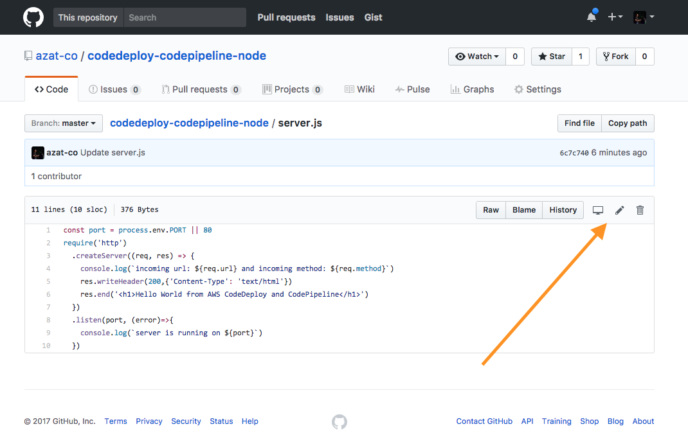
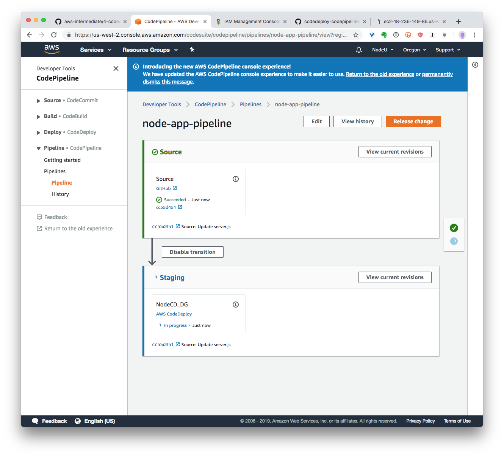
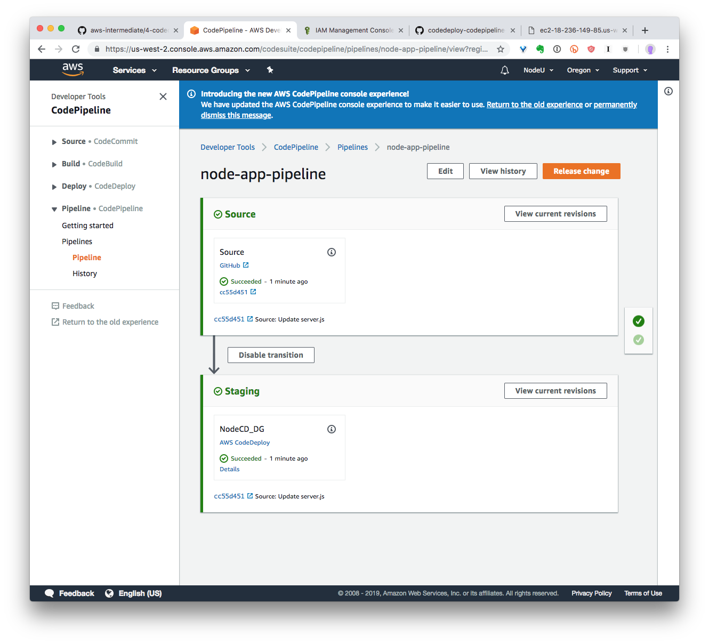

# Lab 4: Never deploy (manually) again!

In a competitive marketplace, the time to market is one of the best advantages a company can have. By delivering products and services faster to customers, validating assumptions and fixing bugs, companies can outcompete slower incumbents (or defend off startups).

As a software engineer, gone are the days of 6 or even 12-month release cycles. The best tech companies deliver code to production multiple times per day. How do they do it? By automating as much as possible with Continuous Integration and Delivery.

Creating CI/CD has long been a tough task requiring high expertise and knowledge of special technologies and libraries, e.g., Jenkins. However, with AWS CodeDeploy and CodePipeline, anyone can create a fully functional CI environment in just a few minutes.


For example, you have some infrastructure provisioned and pull code from GitHub. You update the code in GitHub and in a few moments your changes are live on the public facing HTTP web server. Auto-magic! 🏭🔮

Let's learn how to create this CI now.

# Task

Task: Build CI with CodeDeploy and code from GitHub, update code, and see the changes in a browser


# Walk-through

If you would like to attempt the task, then skip the walk-through and go for the task directly. However, if you need a little bit more hand holding or you would like to look up some of the commands or code or settings, then follow the walk-through.

1. Switch to Oregon `us-west-2` region
1. Create Stack: create an instance with CloudFormation
1. Create CodeDeploy
1. Create App Repo: create and push app and deployment scripts to GitHub
1. Create CodePipeline
1. Test Continuous Integration (CI) by making changes to GitHub and seeing them deployed automatically


## 1. Switch to us-west-2

Becaus CodeDeploy was only available in `us-west-2` originally and not available in other regions, this tutorial uses `us-west-2`. So change AWS CLI to `us-west-2` using the following commands:

```
aws configure
AWS Access Key ID [****************4X4Q]:
AWS Secret Access Key [****************RXSI]:
Default region name [us-west-1]: us-west-2
Default output format [json]:
```

## 2. Create Stack

The stack has instances with CodeDeploy agent, security groups, SSH key pairs, CloudWatch alerts and other things (details in codedeploy-cf-tpm-t2-hvm-3-ec2.json which has HVM and t2 type and is modeled after [CF t1 template ](http://s3-us-west-2.amazonaws.com/aws-codedeploy-us-west-2/templates/latest/CodeDeploy_SampleCF_Template.json), details  [here](http://docs.aws.amazon.com/codedeploy/latest/userguide/instances-ec2-create-cloudformation-template.html))

SSH Key Pair will allow you to SSH into EC2 instances. You can create a key pair in AWS console or with AWS CLI. Keys are region bound. In other words, key pairs are not shared between regions. (Neither any other EC2 resources by the way. This was done on purpose to make each region autonomous and more resilient to any outages.)

Make sure you are using the key from the `us-west-2` region since `us-west-1` region didn't support Pipeline initially and this tutorial is for `us-west-2` (Oregon). In my example, my key name is `azat-aws-course-us-west-2`. I created it in `us-west-2` with this command and used name `azat-aws-course-us-west-2` to differenciate from my other key `azat-aws-course` in `us-west-1`:

```
aws ec2 create-key-pair --key-name azat-aws-course-us-west-2
```

The output is an ASCII version of the private key and key fingerprint. You need to save "KeyMaterial" into to a file with `*.pem` extension, e.g., MyKeyPair.pem. For more information, see [Using Key Pairs](https://docs.aws.amazon.com/cli/latest/userguide/cli-services-ec2-keypairs.html) in the AWS Command Line Interface User Guide.

If you created your own SSH key pair in previous labs in `us-west-2`, then substitute the name with your name of the SSH key pair.


The following command can be launch froom `code/codedeploy-codepipeline` where I put the CF JSON file `codedeploy-cf-tpm-t2-hvm-3-ec2.json`

```
aws cloudformation create-stack \
  --stack-name NodeAppCodeDeployStack \
  --template-body file://codedeploy-cf-tpm-t2-hvm-3-ec2.json \
  --parameters ParameterKey=InstanceCount,ParameterValue=1 ParameterKey=InstanceType,ParameterValue=t2.micro \
    ParameterKey=KeyPairName,ParameterValue=azat-aws-course-us-west-2 \
    ParameterKey=OperatingSystem,ParameterValue=Linux \
    ParameterKey=SSHLocation,ParameterValue=0.0.0.0/0 ParameterKey=TagKey,ParameterValue=Name \
    ParameterKey=TagValue,ParameterValue=NodeAppCodeDeploy \
  --capabilities CAPABILITY_IAM
```

The result will have stack ID because the stack won't be created instantaneously. For example:

```
{
    "StackId": "arn:aws:cloudformation:us-west-2:161599702702:stack/NodeAppCodeDeployStack/2c9819a0-291f-11e7-a213-503f2a2ceeba"
}
```


You can get the current info about the stack, its status and its creation progress with:


```
aws cloudformation describe-stacks
```

It will take a few minutes for AWS to create the stack. Please be patient. You can get a cup of coffee or tea while you wait.

You can monitor progress and debug any issues at the web console as well: <https://us-west-2.console.aws.amazon.com/cloudformation/home?region=us-west-2#/stacks>.

```
aws cloudformation wait stack-create-complete --stack-name NodeAppCodeDeployStack
```

If you made a mistake like using the wrong or nonexistent key pair name, then you'll see `ROLLBACK_COMPLETED` which means there's an error and the entire stack was rollback/reverted to the original state. You will need to remove/delete the stack or using a different stack name for a new create-stack command. To remove/delete stack use `aws cloudformation delete-stack --stack-name NodeAppCodeDeployStack`.

## 3. Create CodeDeploy

### 3.1. Create CodeDeploy Service IAM role

There are two things needed: trust policy and managed policy.
Trust policy is a document in JSON format in which you define who is allowed to assume the role. This trusted entity is included in the policy as the principal element in the document. The document is written according to the rules of the IAM policy language.

You can read more about role terms in [Roles Terms and Concepts](https://docs.aws.amazon.com/IAM/latest/UserGuide/id_roles_terms-and-concepts.html) and the differences in [Managed Policies and Inline Policies](https://docs.aws.amazon.com/IAM/latest/UserGuide/access_policies_managed-vs-inline.html).

Before you create CodeDeploy, it needs IAM role with a special policy. This special policy can be provided in a JSON format (e.g., `codedeploy-role-trust-policy.json`):

```js
{
  "Version": "2012-10-17",
  "Statement": [
    {
      "Sid": "",
      "Effect": "Allow",
      "Principal": {
        "Service": [
          "codedeploy.amazonaws.com"
        ]
      },
      "Action": "sts:AssumeRole"
    }
  ]
}
```

Here's the command to create a role and add a trust relationship policy from a file:

```
aws iam create-role --role-name CodeDeployServiceRole --assume-role-policy-document file://codedeploy-role-trust-policy.json
```

Your output will look similar to this *except* for the Arn:

```js
{
    "Role": {
        "AssumeRolePolicyDocument": {
            "Version": "2012-10-17",
            "Statement": [
                {
                    "Action": "sts:AssumeRole",
                    "Principal": {
                        "Service": [
                            "codedeploy.amazonaws.com"
                        ]
                    },
                    "Effect": "Allow",
                    "Sid": ""
                }
            ]
        },
        "RoleId": "AROAIGUSSHLBINITCLP4K",
        "CreateDate": "2017-04-21T22:16:41.062Z",
        "RoleName": "CodeDeployServiceRole",
        "Path": "/",
        "Arn": "arn:aws:iam::161599702702:role/CodeDeployServiceRole"
    }
}
```

That's not all. We have a role but we need to attach a managed policy to the role.

You can compare roles without (left) and with (right) a managed policy in this AWS Console screenshot:


So the next step is to attach the managed policy. Use the [attach-role-policy](http://docs.aws.amazon.com/cli/latest/reference/iam/attach-role-policy.html) command with your newly created role name (e.g., `CodeDeployServiceRole`) and the policy Arn (i.e., `arn:aws:iam::aws:policy/service-role/AWSCodeDeployRole` - **do NOT change Arn**):

```
aws iam attach-role-policy --role-name CodeDeployServiceRole --policy-arn arn:aws:iam::aws:policy/service-role/AWSCodeDeployRole
```

To get the Role ID (Arn) the policy has been attached to the role right away:

```
aws iam get-role --role-name CodeDeployServiceRole
```

Or just get the Role.Arn to use later by using `--query` for filtering out the output information:

```
aws iam get-role --role-name CodeDeployServiceRole --query "Role.Arn" --output text
```

Remember your newly created IAM role Arn. You will need it to create deployment group.

My output has my AWS account number in it and looks similar to this:

```
arn:aws:iam::161599702702:role/CodeDeployServiceRole
```

Save yours!

## 3.2. Create an application with CodeDeploy

Next, you need to create an application. Run the following command:

```
aws deploy create-application --application-name Node_App
```

More info on the command: <http://docs.aws.amazon.com/cli/latest/reference/deploy/create-application.html>.

The response example is as follows (your ID will be different):

```
{
    "applicationId": "1344dfd5-eb91-4940-bd07-5bb55aff5db7"
}
```

That's all here.


### 3.3. Create CodeDeploy deployment group

Finally for CodeDeploy, create a deployment group that links application name and instance tags. In other words, deployment group will connect the application `Node_App` (in my examples) and instance(s) that we created with CloudFormation earlier.

Important! **Instead of my service role Arn, insert yours from the CodeDeploy service role in step 3.1.** If you're getting "Cross-account pass role is not allowed." then you didn't provide the correct Arn. (Hint, those digits in the IAM Arn is your AWS account ID. More details [here](http://docs.aws.amazon.com/general/latest/gr/aws-arns-and-namespaces.html#arn-syntax-iam)). If you forgot the role Arn, then execute this command first

```
aws iam get-role --role-name CodeDeployServiceRole --query "Role.Arn" --output text
```

If you are working on a shared account with other students (people taking this course), then replace the EC2 tag value with your name. This will help you to identify your instances from everyone elses. Also, replace the Arn in my example and run `create-deployment-group`:

```
aws deploy create-deployment-group --application-name Node_App \
  --deployment-config-name CodeDeployDefault.OneAtATime \
  --deployment-group-name NodeCD_DG \
  --ec2-tag-filters Key=Name,Value=NodeAppCodeDeploy,Type=KEY_AND_VALUE \
  --service-role-arn arn:aws:iam::161599702702:role/CodeDeployServiceRole
```

The `--deployment-config-name CodeDeployDefault.OneAtATime` means one at a time. There's all at once and half at once options as well.

Your result will have a deploymentGroupId as well:

```
{
    "deploymentGroupId": "e4d34ce4-e25c-44c5-b3c4-064065ce474a"
}
```

More info: <http://docs.aws.amazon.com/codedeploy/latest/userguide/deployment-groups-create.html>

## 4. Create App Repo

You can use the provided GitHub repository <https://github.com/azat-co/codedeploy-codepipeline-node> which has a Node HTTP server and shell scripts, but if you want to modify the code, then you will need to do:

1. Fork repository to have your own copy which you can modify (commit and push)
2. Create a new repository from scratch following steps below

Create application code with the following structure:

```
/scripts
appspec.yml
server.js
```

The `appspec.yml` will have instructions for AWS on how to deploy the code (and even verify it!). For example, my `appspec.yml` is using four scripts and copying the source file into `/var/www`:

```yml
version: 0.0
os: linux
files:
  - source: server.js
    destination: /var/www/
hooks:
  BeforeInstall:
    - location: scripts/install_dependencies.sh
      timeout: 300
      runas: root
  ApplicationStart:
    - location: scripts/start_server.sh
      timeout: 300
  ApplicationStop:
    - location: scripts/stop_server.sh
      timeout: 300
      runas: root
  ValidateService:
    - location: scripts/validate_server.sh
      timeout: 300
      runas: root
```

There are more possible configs like the ones shown below:


The `server.js` file is our HTTP server written in Node.js. It uses Node version 6 and ECMAScript2015 (ES6). It will display Hello World HMTL when you navigate to the public URL (public DNS name without port). No port necessary because 80 is the default HTTP port. You can also provide a custom port number in environment variable `PORT`.

```js
const port = process.env.PORT || 80
require('http')
  .createServer((req, res) => {
    console.log(`incoming url: ${req.url} and incoming method: ${req.method}`)
    res.writeHeader(200,{'Content-Type': 'text/html'})
    res.end('<h1>Hello World from CodeDeploy and CodePipeline</h1>')
  })
  .listen(port, (error)=>{
    console.log(`server is running on ${port}`)
  })
```

The shell script file `scripts/install_dependencies.sh` has the following content:

```
#!/bin/bash
# update yum just in case
yum update -y
# get node into yum
curl --silent --location https://rpm.nodesource.com/setup_6.x | bash -
# install node and npm in one line
yum install -y nodejs
# install pm2 to restart node app
npm i -g pm2@2.4.3
```

The script to start the Node server `scripts/start_server.sh` has these commands:

```
#!/bin/bash
# sudo chmod 755 /var/www/server.js # optional
# this will restart app/server on instance reboot
crontab -l | { cat; echo "@reboot pm2 start /var/www/server.js -i 0 --name \"node-app\""; } | crontab -
sudo pm2 stop node-app
# actually start the server
sudo pm2 start /var/www/server.js -i 0 --name "node-app"
```

`scripts/stop_server.sh`:

```
#!/bin/bash
sudo pm2 stop node-app
```

`scripts/validate_server.sh`:

```
#!/bin/bash
curl -m 5 http://localhost
```


Save files, create a GitHub repository, commit code and push it to the GitHub repository.

## 5. Create CodePipeline

Now we can connect source code repository like GitHub (or S3) to CodeDeploy to enable CI.
CLI is a bit cumbersome because you'll need to manually create IAM role and S3 bucket. We will cover it first then cover the web console wizard which is very straightforward because it creates the role and bucket for you.

If you use web console, wizard will create S3 bucket and IAM role for you. Thus, use web console for this step or the following AWS CLI commands.

Thus, you have two options:

* CodePipeline via CLI (option A): create IAM role and pipeline from CLI - recommended
* CodePipeline via Web Console (option B): by using wizard, no need to create role or pipeline structure manually - easier

### 5.1. CodePipeline via CLI (option A)

Create a bucket to store artifacts for the pipeline. Be careful with the name. It must be globally unique. If you're getting "The requested bucket name is not available." then change the bucket name (try adding more random numbers and characters).

```
aws s3 mb s3://node-app-pipeline-bucket-346128301596 --region us-west-2
```

Save the bucket name somewhere. We'll need it in the future.

Next, you will need a role for the pipeline. It will need to have two things: trust policy and inline policy.

First, create a role with the trust policy document from a file. This is the trust policy document:

```js
{
  "Version": "2012-10-17",
  "Statement": [
    {
      "Sid": "",
      "Effect": "Allow",
      "Principal": {
        "Service": [
          "codepipeline.amazonaws.com"
        ]
      },
      "Action": "sts:AssumeRole"
    }
  ]
}
```

This is the command to create the role with the trust policy:

```
aws iam create-role --role-name CodePipelineServiceRole \
  --assume-role-policy-document file://codepipeline-role-trust-policy.json
```

The output will be like this one:

```js
{
    "Role": {
        "AssumeRolePolicyDocument": {
            "Version": "2012-10-17",
            "Statement": [
                {
                    "Action": "sts:AssumeRole",
                    "Principal": {
                        "Service": [
                            "codepipeline.amazonaws.com"
                        ]
                    },
                    "Effect": "Allow",
                    "Sid": ""
                }
            ]
        },
        "RoleId": "AROAJ6VXDGROHN24YWHRW",
        "CreateDate": "2017-04-25T15:34:58.529Z",
        "RoleName": "CodePipelineServiceRole",
        "Path": "/",
        "Arn": "arn:aws:iam::161599702702:role/CodePipelineServiceRole"
    }
}
```

Now add the inline policy (different from the trust policy we used before) from a file that I provide in `code`:

```
aws iam put-role-policy --role-name CodePipelineServiceRole --policy-name CodePipelineServiceRoleNodeAppPolicy --policy-document file://codepipeline-role-inline-policy.json
```


Get GitHub token. You will feed it to AWS CLI. Personal access token will be just fine. You can get it by going to: <https://github.com/settings/tokens> (need to be logged in) and clicking on *Generate new token*:


Enter the name and select the minimal number of permissions. My repo is public so I only have checked the access to `public_repo`, `repo:status` and `repo_deployment` in my GitHub access token's setting. You can copy my settings if your repository is public. Copy the token. You will NOT see it again. When the GitHub access token exists, add and verify that it has enough permissions.

Obviously, if your repository is private, you'll need to give access to CodePipeline via the personal access token setting `repo`. See more details about settings (GitHub's OAuth scopes) at [GitHub documentation for OAuth scopes.](https://developer.github.com/apps/building-integrations/setting-up-and-registering-oauth-apps/about-scopes-for-oauth-apps)


Do you still have the GitHub token? Now you need to create a file which will configure the pipeline. Here's my example of the CodePipeline structure which is also in the `node-app-pipeline.json`. **Remember, you'll need to replace a few values listed below the JSON**.

Beware, not to save this file into you code repository because it'll contain the access token.

```
{
    "pipeline": {
        "roleArn": "arn:aws:iam::161599702702:role/CodePipelineServiceRole",
        "stages": [
            {
                "name": "Source",
                "actions": [
                    {
                        "inputArtifacts": [],
                        "name": "Source",
                        "actionTypeId": {
                            "category": "Source",
                            "owner": "ThirdParty",
                            "version": "1",
                            "provider": "GitHub"
                        },
                        "outputArtifacts": [
                            {
                                "name": "MyApp"
                            }
                        ],
                        "configuration": {
                            "Owner": "azat-co",
                            "Repo": "codedeploy-codepipeline-node",
                            "Branch": "master",
                            "OAuthToken": "****"
                        },
                        "runOrder": 1
                    }
                ]
            },
            {
                "name": "Staging",
                "actions": [
                    {
                        "inputArtifacts": [
                            {
                                "name": "MyApp"
                            }
                        ],
                        "name": "NodeCD_DG",
                        "actionTypeId": {
                            "category": "Deploy",
                            "owner": "AWS",
                            "version": "1",
                            "provider": "CodeDeploy"
                        },
                        "outputArtifacts": [],
                        "configuration": {
                            "ApplicationName": "Node_App",
                            "DeploymentGroupName": "NodeCD_DG"
                        },
                        "runOrder": 1
                    }
                ]
            }
        ],
        "artifactStore": {
            "type": "S3",
            "location": "node-app-pipeline-bucket-346128301596"
        },
        "name": "node-app-pipeline",
        "version": 3
    }
}
```

The structure has two stages: source and deploy. You can keep adding more stages later like testing or build. See [this](http://docs.aws.amazon.com/codepipeline/latest/userguide/reference-pipeline-structure.html) for more info on pipeline structure.

**IMPORTANT:** You should at the very least replace the following because create-pipeline CLI won't create them for you. So you need to have CodePipeline service IAM role and the S3 bucket created first.

* `artifactStore`, S3 bucket name for the bucket in the same region, e.g., my value is `codepipeline-us-west-2-346128301595`
* `roleArn`, the IAM role which has the inline policies for the CodePipeline, e.g., `arn:aws:iam::161599702702:role/CodePipelineServiceRole` (not `CodeDeployServiceRole`!)
* `OAuthToken`: your GitHub Access OAuth token (personal or from an app)

Also you **must** replace the source code repository values:

* `Owner`: your GitHub username, must be just a string, e.g., "azat-co"
* `Repo`: your GitHub repository, must be just the name, not a URL, e.g., "codedeploy"
* `Branch`: your GitHub repository branch, just a string, e.g., "master"

These next items are optional. You *might* need to modify other values depending on what values you used in the previous steps of this lab. Here's the list of the values which you need to **replace, verify and modify**:

* `name`: arbitrary name
* `ApplicationName`: your application name from CodeDeploy, e.g., `Node_App`
* `DeploymentGroupName`: your deployment group name from CodeDeploy step, e.g., `NodeCD_DG`


Once you've gotten your JSON pipeline structure with your own values and have saved it in some file (e.g., `pipeline.json`). Create a pipeline with AWS CLI. Simply run the command below to create a new pipeline, but of course verify and replace the file name `pipeline.json` if needed:

```
aws codepipeline create-pipeline --cli-input-json file://pipeline.json
```


The result of the command will be printed as the JSON file you supplied.

More info: <http://docs.aws.amazon.com/codepipeline/latest/userguide/pipelines.html>.

If you need to update your pipeline (maybe you forgot to put your role or GitHub token), then use this command:

```
aws codepipeline update-pipeline --cli-input-json file://pipeline.json
```

Funny thing is that even [AWS docs recommend creating pipeline structure from existing pipelines](http://docs.aws.amazon.com/codepipeline/latest/userguide/pipelines-create.html#pipelines-create-cli-json). You can export a pipeline JSON from an existing pipeline with this command:

```
aws codepipeline get-pipeline --name node-app-pipeline
```

Of course, it's of little use if you are creating the first pipeline. However, there's a web wizard which is as an alternative to AWS CLI. In some ways, web wizard will do more things for you (like making sure the role is the right one), but the downside is that with the web wizard is harder to automate than a series of shell scripts.


You can verify the pipeline in AWS console. This is the new look:


Of course, we can check the status from the CLI (or SDK). For example

```
aws codepipeline list-pipelines
aws codepipeline  get-pipeline-state --name node-app-pipeline
```

To (re)start the pipeline, use:

```
aws codepipeline start-pipeline-execution --name node-app-pipeline
```

Everytime there's a change in code or you restart the pipeline automatically, there would be a new deploy. Yay!

The next section is doing the same creation of the pipeline but from the console. You can skip it and go to testing.


### 5.1. CodePipeline via Web Console (option B)

This step is optional. We use mostly CLI during this course, but because pipeline creating involved a few steps, you might want to consider using web console and its pipeline wizard.

To use web wizard, simple go to Oregon `us-west-2` region, Developer Tools | CodePipeline. Click on Create pipeline.

On step 1, enter the pipeline name:


On step 2 (Source), connect with GitHub by entering your GitHub credentials.


Then still on step 2, select the app repository, the one which has `appspec.yml`.


Skip step 3 (Build) for this lab. In a real setup, builds are important but out of the scope of this lab. However you will be able to add more stages to the pipeline later, once this lab is done once and the pipeline is created.

The next step is step number 4: Source, select AWS CodeDeploy. Provide your app name (create before) and group (also created before in this lab):


On the step 5, you can select an existing pipeline service role if you have it or click the button to let the wizard create a new role with appropriate policy for you.

```
aws codepipeline get-pipeline --name node-app-pipeline
```

The end result of creating the pipeline should look like the one shown below:


It shows you the GitHub hash of the commit, and status of the deployment. The first deployment should start automatically. The next deployment will be started on each new `git push` to GitHub or manually by pressing "Release change".


## 6. Test CI

Now the last and the funniest and the most awesome part of this long lab. We will find out the server URL (public DNS name) and test out rapid automatic deployment by pushing new code to GitHub.

First, we have many options to find out the server URL. Let's start with CLI commands. This command will list all running instances' DNS names:

```
aws ec2 describe-instances --filter 'Name=instance-state-code,Values=16' --query 'Reservations[*].Instances[*].PublicDnsName'
```

If we have too many insances under this account in this region, then let's use deployment group to find out the instance ID. First, pick a deployment ID

```
aws deploy list-deployments
```

You'll get something like

```
{
    "deployments": [
        "d-DSCWW6FEY"
    ]
}
```

Then get associated instances with:

```
aws deploy list-deployment-instances --deployment-id d-DSCWW6FEY
```

```
{
    "instancesList": [
        "i-0b943cfcc3d1be85e"
    ]
}
```

Then you can get DNS:

```
 aws ec2 describe-instances --filter 'Name=instance-state-code,Values=16' --query 'Reservations[*].Instances[*].PublicDnsName' --instance-ids "i-0b943cfcc3d1be85e"
```

It'll look like this:

```
[
    [
        "ec2-18-236-149-85.us-west-2.compute.amazonaws.com"
    ]
]
```

If you have a lot of other instances, filter them by EC2 tags (which you set when creating deployment group): `tag-value` and `tag-key` in `--filter`.

Another way to find out the URL is via the AWS console. Once deploy is done without error as shown in the deploy web console, you can grab the public URL and verify that you can see Hello World HTML in the browser.


**Now let's make some code changes.** Go to your GitHub repository and modify `server.js` by changing Hello World text or adding a new tag or doing whatever if you know Node (take my course on Node at <https://node.university>).

```js
const port = process.env.PORT || 80
require('http')
  .createServer((req, res) => {
    console.log(`incoming url: ${req.url} and incoming method: ${req.method}`)
    res.writeHeader(200,{'Content-Type': 'text/html'})
    res.write('<p>Buenos dias Montevideo</p>') // YOU CAN KEEP ADDING NEW HTML HERE with res.write()
    res.end('<h1>Hello World from amazing Node University course AWS Intermediate</h1>')
  })
  .listen(port, (error)=>{
    console.log(`server is running on ${port}`)
  })
```

You can use GitHub web editor or just use your local code editor and git CLI to commit and push instead of using the GitHub web interface. If you are using GitHub website, you can commit right to master from there, see below:




Verify that Pipeline started the deploy. If you look at the pipeline right away, you'll see that source is picked up the changes but the staging is not ready yet.



Wait and verify that your new text appears on the public website. After a few seconds or minutes, you'll see that the staging is ready (green):



You can monitor the stages and progress in the CodePipeline web dashboard.

Now, go to the the URL (mine stayed the same but you can get the public DNS from the EC2 instance from the deploy group). See the new changes.

Congratulations. 👏 You've created a CI with ability extend to CD (add builds!) in just under a half-hour or so.

Now that you know what steps are involved, you can create a CloudFormation file which will create the steps 2, 3 and 5 in this labs in one command (stack/instances, CodeDeploy and Pipeline). In other words, you will be able to just run `aws cloudformation create-stack...`. Take a look at [this example](https://github.com/andreaswittig/codepipeline-codedeploy-example/blob/master/deploy/stack.yml) in which all you need is just run `setup.sh` (for more details, see [GitHub readme.md](https://github.com/andreaswittig/codepipeline-codedeploy-example)).

Don't forget to remove your EC2 instance and other pipeline resources by rolling back the stack. Otherwise your AWS bill will be costly next month. :)

# Troubleshooting

* Cannot see Hello World on the deployed public URL. Go to your pipeline view from [pipeline dashboard](https://us-west-2.console.aws.amazon.com/codepipeline/home?region=us-west-2#/dashboard), e.g., [node-app-pipeline view](https://us-west-2.console.aws.amazon.com/codepipeline/home?region=us-west-2#/view/node-app-pipeline). See if you have failed deploy. By clicking on failed deploy you can see logs of each script like BeforeInstall.
* CloudFormation fails when you try to create stack (EC2 instance with CodeDeploy agent): you can trouble shoot/debug from the CloudFormation dashboard by inspecting events and logs. Alternatively, you can [create CodeDeploy EC2 instance manually](http://docs.aws.amazon.com/codedeploy/latest/userguide/instances-ec2-create.html). Make sure you tag is accordingly and the instance has CodeDeploy agent or use an image with CodeDeploy (Amazon Linux CodeDeploy AMI).
* Source stage fails in CodePipeline. Make sure your GitHub access token has enough permissions to access your repository.
