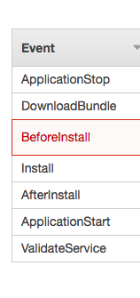
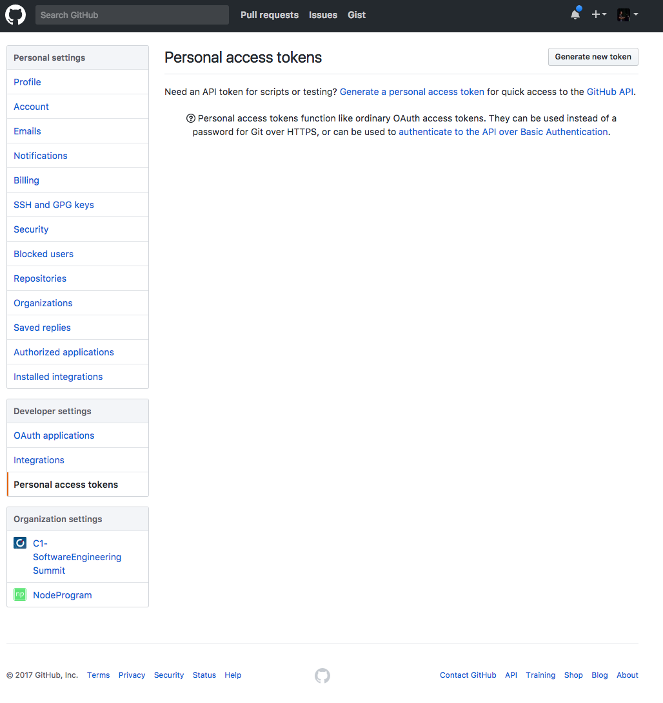
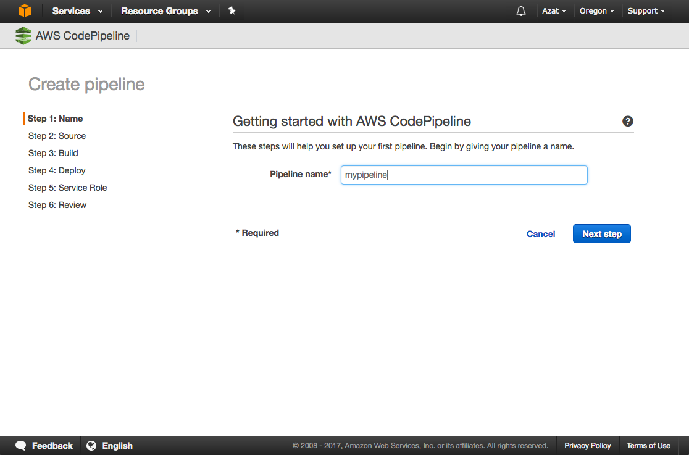
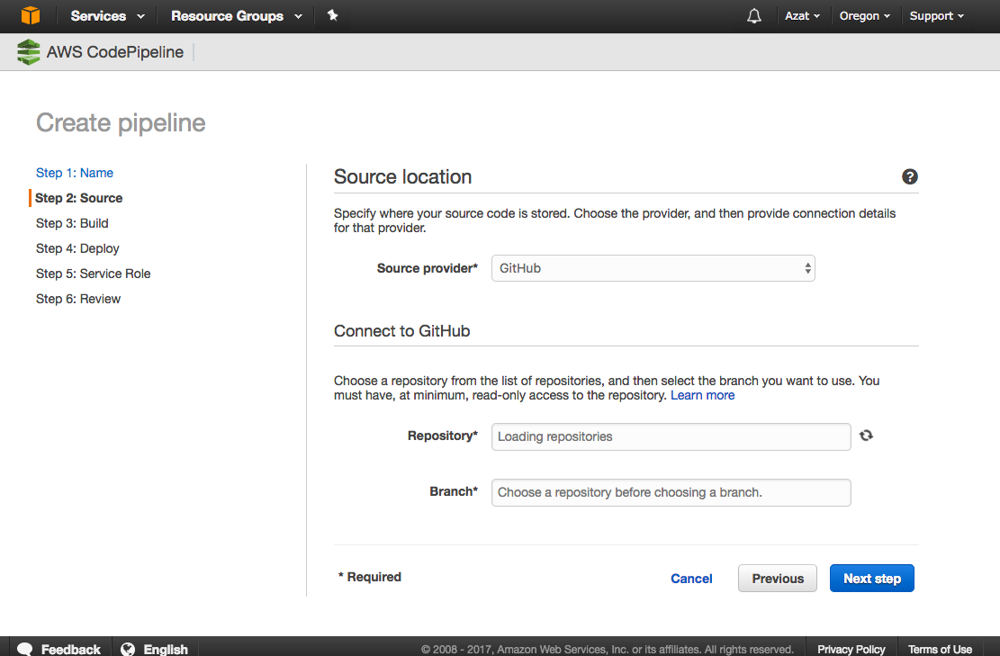
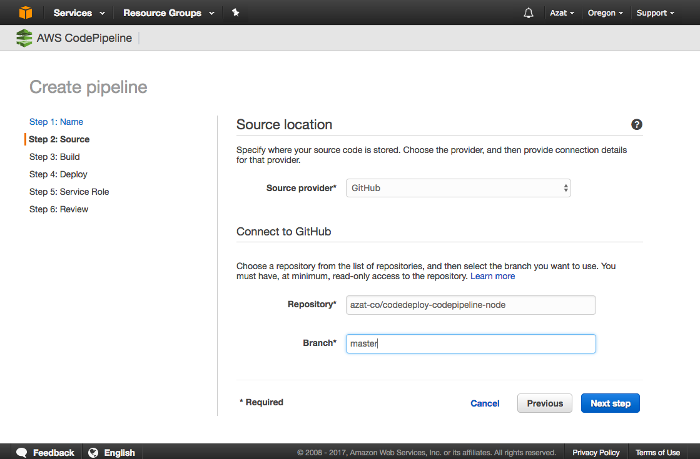
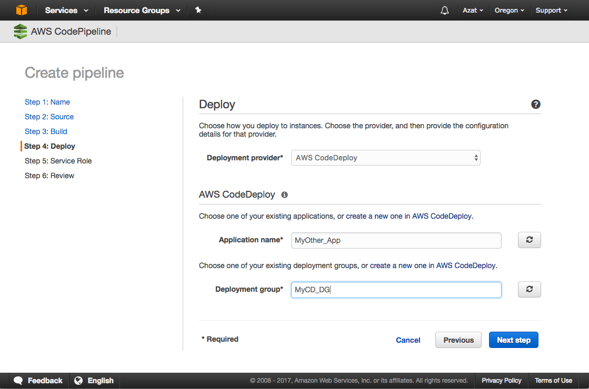
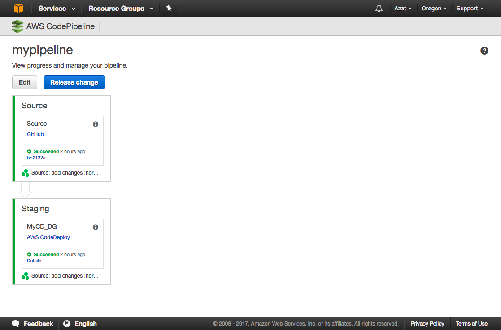
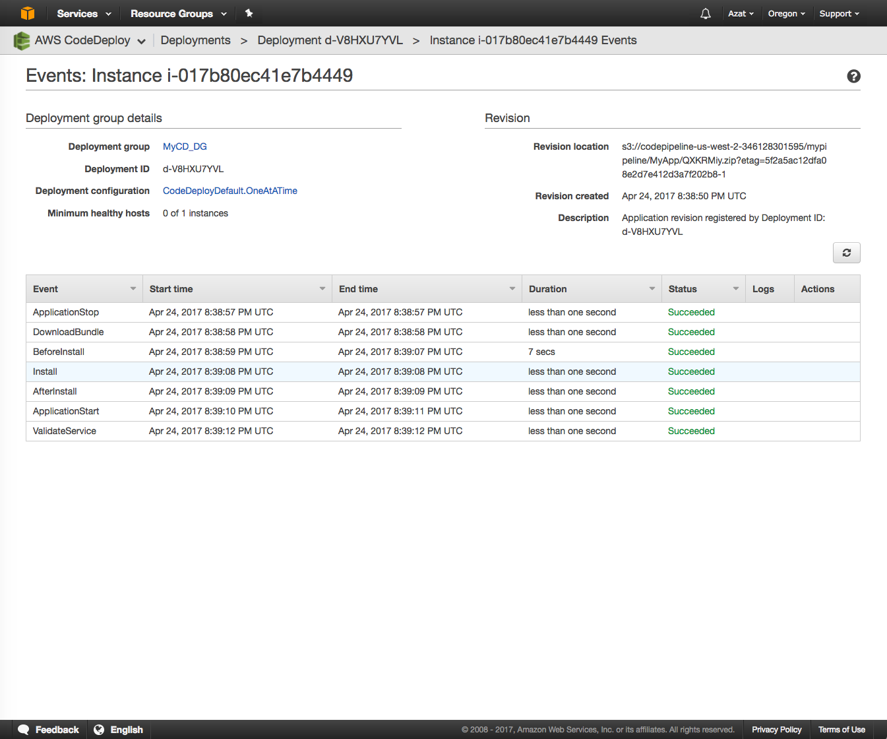

# Lab 4: Never deploy (manually) again!

In an competitive marketplace, time to market is one of the best advantages a company can have. By delivering products and services faster to customers, validating assumptions and fixing bugs, companies can outcompete slower incumbents (or defend off startups).

As a software engineer, gone are the days of 6 or even 12-month release cycles. The best tech companies deliver code to production multiple times per day. How do they do it? By automating as much as possible with Continuous Integration and Delivery.

Creating CI/CD has long been a tough task requiring high expertise and knowledge of special technologies and libraries, e.g., Jenkins. However, with AWS CodeDeploy and CodePipeline, anyone can create a fully functional CI environment in just a few minutes.  For example, you have some infrastructure provisioned and pull code from GitHub. You update the code in GitHub and in a few moments your changes are live on the public facing HTTP web server. Auto-magic! 🏭

Let's learn create this CI now.

# Task

Task: Build CI with CodeDeploy and code from GitHub, update code, see change in a browser


# Walk-through

If you would like to attempt the task, go skip the walk-through and for the task directly. However, if you need a little bit more hand holding or you would like to look up some of the commands or code or settings, then follow the walk-through.

1. Switch to Oregon `us-west-2` region
1. Create Stack: create an instance with CloudFormation
1. Create CodeDeploy
1. Create App Repo: create and push app and deployments scripts to GitHub
1. Create CodePipeline
1. Test Continuous Integration (CI) by making changes to GitHub and seeing them deployed automatically


## 1. Switch to us-west-2

```
aws configure
AWS Access Key ID [****************4X4Q]:
AWS Secret Access Key [****************RXSI]:
Default region name [us-west-1]: us-west-2
Default output format [json]:
```

## 2. Create Stack

The stack has instances with CodeDeploy agent, security groups, SSH key pairs, CloudWatch alerts and other things (details in codedeploy-cf-tpm-t2-hvm-3-ec2.json which has HVM and t2 type and is modeled after [CF t1 template ](http://s3-us-west-2.amazonaws.com/aws-codedeploy-us-west-2/templates/latest/CodeDeploy_SampleCF_Template.json), details  [here](http://docs.aws.amazon.com/codedeploy/latest/userguide/instances-ec2-create-cloudformation-template.html))

Make sure you are using the key from the `us-west-2` region since `us-west-1` region doesn't support Pipeline yet.
In my example, my key name is `azat-aws-course-aws-us-west-2.

```
aws cloudformation create-stack \
  --stack-name CodeDeployDemoStack \
  --template-body file://codedeploy-cf-tpm-t2-hvm-3-ec2.json \
  --parameters ParameterKey=InstanceCount,ParameterValue=1 ParameterKey=InstanceType,ParameterValue=t2.micro \
    ParameterKey=KeyPairName,ParameterValue=azat-aws-course-aws-us-west-2 \
    ParameterKey=OperatingSystem,ParameterValue=Linux \
    ParameterKey=SSHLocation,ParameterValue=0.0.0.0/0 ParameterKey=TagKey,ParameterValue=Name \
    ParameterKey=TagValue,ParameterValue=CodeDeployDemo \
  --capabilities CAPABILITY_IAM
```

Result will have stack ID because the stack won't be created instanteniously. For exmaple:

```
{
    "StackId": "arn:aws:cloudformation:us-west-2:161599702702:stack/CodeDeployDemoStack/2c9819a0-291f-11e7-a213-503f2a2ceeba"
}
```

You can get current info about the stack, its status and its creation progress with:

```
aws cloudformation describe-stacks
```

You can monitor progress and debug any issues at the web console as well: <https://us-west-2.console.aws.amazon.com/cloudformation/home?region=us-west-2#/stacks>.

```
aws cloudformation wait stack-create-complete --stack-name $STACK_NAME
```

## 3. Create CodeDeploy

### 3.1. Create CodeDeploy Service IAM role

```
aws iam create-role --role-name CodeDeployServiceRole --assume-role-policy-document file://codedeploy-service-role-policy.json
```

```js
{
    "Role": {
        "AssumeRolePolicyDocument": {
            "Version": "2012-10-17",
            "Statement": [
                {
                    "Action": "sts:AssumeRole",
                    "Principal": {
                        "Service": [
                            "codedeploy.amazonaws.com"
                        ]
                    },
                    "Effect": "Allow",
                    "Sid": ""
                }
            ]
        },
        "RoleId": "AROAIGUSSHLBINITCLP4K",
        "CreateDate": "2017-04-21T22:16:41.062Z",
        "RoleName": "CodeDeployServiceRole",
        "Path": "/",
        "Arn": "arn:aws:iam::161599702702:role/CodeDeployServiceRole"
    }
}
```

```
aws iam attach-role-policy --role-name CodeDeployServiceRole --policy-arn arn:aws:iam::aws:policy/service-role/AWSCodeDeployRole
```

Verify:

```
aws iam get-role --role-name CodeDeployServiceRole
```

Or just get the Role.Arn to use later:

```
aws iam get-role --role-name CodeDeployServiceRole --query "Role.Arn" --output text
```

My output is:

```
arn:aws:iam::161599702702:role/CodeDeployServiceRole
```

Save yours!

## 3.2. Create an application with CodeDeploy

Next, you need to create an application. Run the following:

```
aws deploy create-application --application-name MyOther_App
```

Response example:

```
{
    "applicationId": "1344dfd5-eb91-4940-bd07-5bb55aff5db7"
}
```

More info: <http://docs.aws.amazon.com/cli/latest/reference/deploy/create-application.html>

### 3.3. Create CodeDeploy deployment group

Finally for CodeDeploy, create a deployment group which uses application name and instance tags. In other words, deployment group will link application and instance(s) (which we created with CloudFormation):

```
aws deploy create-deployment-group --application-name MyOther_App \
  --deployment-config-name CodeDeployDefault.OneAtATime \
  --deployment-group-name MyCD_DG \
  --ec2-tag-filters Key=Name,Value=CodeDeployDemo,Type=KEY_AND_VALUE \
  --service-role-arn arn:aws:iam::161599702702:role/CodeDeployServiceRole
```

The `--deployment-config-name CodeDeployDefault.OneAtATime` means one at a time. There's all at once and half at once options as well.

Results:

```
{
    "deploymentGroupId": "e4d34ce4-e25c-44c5-b3c4-064065ce474a"
}
```


More info: <http://docs.aws.amazon.com/codedeploy/latest/userguide/deployment-groups-create.html:

## 4. Create App Repo

If you can use provided GitHub repository <https://github.com/azat-co/codedeploy-codepipeline-node>, but if you want to modify code you will need to do:

1. Fork repository to have your own copy which you can modify (commit and push)
1. Create a new repository from scratch following steps below

Create application code with the following structure

```
/scripts
appspec.yml
server.js
```

The `appspec.yml` will have instructions for AWS on how to deploy the code (and even verify it!). For example, my `appspec.yml` is using four scripts and copying the source file into `/var/www`:

```yml
version: 0.0
os: linux
files:
  - source: server.js
    destination: /var/www/
hooks:
  BeforeInstall:
    - location: scripts/install_dependencies.sh
      timeout: 300
      runas: root
  ApplicationStart:
    - location: scripts/start_server.sh
      timeout: 300
  ApplicationStop:
    - location: scripts/stop_server.sh
      timeout: 300
      runas: root
  ValidateService:
    - location: scripts/validate_server.sh
      timeout: 300
      runas: root
```

There are more possible configs like the ones shown below:



The `server.js` file is our HTTP server written in Node.js. It uses Node version 6 and ECMAScript2015 (ES6). It will display Hello World HMTL when you navigate to the public URL (public DNS name without port). No port necessary because 80 is the default HTTP port. You can also provide a custom port number in environment variable `PORT`.

```js
const port = process.env.PORT || 80
require('http')
  .createServer((req, res) => {
    console.log(`incoming url: ${req.url} and incoming method: ${req.method}`)
    res.writeHeader(200,{'Content-Type': 'text/html'})
    res.end('<h1>Hello World from CodeDeploy and CodePipeline</h1>')
  })
  .listen(port, (error)=>{
    console.log(`server is running on ${port}`)
  })
```

`scripts/install_dependencies.sh`:

```
#!/bin/bash
# update yum just in case
yum update -y
# get node into yum
curl --silent --location https://rpm.nodesource.com/setup_6.x | bash -
# install node and npm in one line
yum install -y nodejs
# install pm2 to restart node app
npm i -g pm2@2.4.3
```

`scripts/start_server.sh`:

```
#!/bin/bash
# sudo chmod 755 /var/www/server.js # optional
# this will restart app/server on instance reboot
crontab -l | { cat; echo "@reboot pm2 start /var/www/server.js -i 0 --name \"node-app\""; } | crontab -
sudo pm2 stop node-app
# actually start the server
sudo pm2 start /var/www/server.js -i 0 --name "node-app"
```

`scripts/stop_server.sh`:

```
#!/bin/bash
sudo pm2 stop node-app
```

`scripts/validate_server.sh`:

```
#!/bin/bash
curl -m 5 http://localhost
```


Save files, create a GitHub repository, commit code and push it to the GitHub repository.

## 5. Create CodePipeline

Now we can connect source code repository like GitHub (or S3) to CodeDeploy to enable CI.
CLI is a bit cumbersome because you'll need to manually create IAM role and S3 bucket. We will cover it first then cover the web console wizard which is very straightforward because it creates the role and bucket for you.

Get GitHub token (for CLI): <https://github.com/settings/tokens>.



Here's my example:

```
{
    "pipeline": {
        "roleArn": "arn:aws:iam::161599702702:role/AWS-CodePipeline-Service",
        "stages": [
            {
                "name": "Source",
                "actions": [
                    {
                        "inputArtifacts": [],
                        "name": "Source",
                        "actionTypeId": {
                            "category": "Source",
                            "owner": "ThirdParty",
                            "version": "1",
                            "provider": "GitHub"
                        },
                        "outputArtifacts": [
                            {
                                "name": "MyApp"
                            }
                        ],
                        "configuration": {
                            "Owner": "azat-co",
                            "Repo": "codedeploy-codepipeline-node",
                            "Branch": "master",
                            "OAuthToken": "****"
                        },
                        "runOrder": 1
                    }
                ]
            },
            {
                "name": "Staging",
                "actions": [
                    {
                        "inputArtifacts": [
                            {
                                "name": "MyApp"
                            }
                        ],
                        "name": "MyCD_DG",
                        "actionTypeId": {
                            "category": "Deploy",
                            "owner": "AWS",
                            "version": "1",
                            "provider": "CodeDeploy"
                        },
                        "outputArtifacts": [],
                        "configuration": {
                            "ApplicationName": "MyOther_App",
                            "DeploymentGroupName": "MyCD_DG"
                        },
                        "runOrder": 1
                    }
                ]
            }
        ],
        "artifactStore": {
            "type": "S3",
            "location": "codepipeline-us-west-2-346128301595"
        },
        "name": "mypipeline",
        "version": 3
    }
}
```

See [this](http://docs.aws.amazon.com/codepipeline/latest/userguide/reference-pipeline-structure.html) for more info on pipeline structure.

You should at the very least you must replace the following because create-pipeline CLI won't create them for you. So you need to have CodePipeline service IAM role and the S3 bucket created first.

* artifactStore, e.g., my value is `codepipeline-us-west-2-346128301595`
* roleArn, e.g., arn:aws:iam::161599702702:role/AWS-CodePipeline-Service

If you use web console, wizard will create S3 bucket and IAM role for you. Thus, use web console for this step or the following AWS CLI commands:

```
aws s3api create-bucket --bucket my-bucket --region us-east-2
aws iam create-role --role-name CodePipelineServiceRole \
  --assume-role-policy-document file://pipeline-service-role.json
```

Other values you might need to modify depending on what values did you use in previous steps of this lab are:

* name: arbitrary name
* pipeline.stages[].actions.configuration.Owner - your GitHub username
* pipeline.stages[].actions.configuration.Repo - your GitHub repository
* pipeline.stages[].actions.configuration.Branch - your GitHub repository branch (e.g., master)
* pipeline.stages[].actions.configuration.OAuthToken - your GitHub Access OAUth token (personal or from an app)
* "ApplicationName": your application name from CodeDeploy, e.g., "MyOther_App"
* "DeploymentGroupName": your deployment group name from CodeDeploy step, e.g., "MyCD_DG"

Once you get your JSON pipeline structure, run this:

```
aws codepipeline create-pipeline --cli-input-json file://pipeline.json
```

More info: <http://docs.aws.amazon.com/codepipeline/latest/userguide/pipelines.html>

Funny thing that even AWS docs recommend creating pipeline structure from existing pipelines. You can export a pipeline JSON from an existing pipeline with this command:

```
aws codepipeline get-pipeline --name mypipeline
```

Of course, it's of little use if you are creating the first pipeline. However, there's a web wizard. Let' use it just as an alternative to CLI.

To use web wizard, simple go to Oregon `us-west-2` region, Developer Tools | CodePipeline. Click on Create pipeline.
Enter name,



Connect with GitHub by entering your GitHub credentials.



Select the app repository, the one which has `appspec.yml`.



Skip build. Builds are important and you will be able to add more stages later.

On the screen after that which is number 4: Source, select AWS CodeDeploy, your app name (create before) and group (also created before in this lab).



On the screen 5, you can select an existing pipeline service role if you have it or click the button to let the wizard create a new role with appropriate policy for you.

```
aws codepipeline get-pipeline --name mypipeline
```

The end result of creating the pipeline should look like the one shown below:



It shows you the GitHub hash of the commit, and status of the deployment. The first deployment should start automatically. Next will be started on each new `git push` to GitHub or by pressing "Release change".


## 6. Test CI

Once deploy is done without error as shown in the deploy web console, you can grab the public URL and verify that you can see Hello World HTML in the browser.



Go to your GitHub and modify `server.js` by changing Hello World text. Commit and push (if you are using GitHub website, you can commit right to master from there). Verify that Pipeline started the deploy. Wait and verify that your new text appears on the public website.

Congratulations. 👏 You've created a CI with ability extend to CD (add builds!) in just under a half-hour or so.

Now that you know what steps are involved, you can create a CloudFormation file which will create the steps 2, 3 and 5 in this labs in one command (stack/instances, CodeDeploy and Pipeline). In other words, you will be able to just run `aws cloudformation creat-stack...`. Take a look at [this example](https://github.com/andreaswittig/codepipeline-codedeploy-example/blob/master/deploy/stack.yml) in which all you need is just run `setup.sh` ([GitHub readme.md](https://github.com/andreaswittig/codepipeline-codedeploy-example)).

# Troubleshooting

* No Hello World. Go to your pipeline view from [pipeline dashboard](https://us-west-2.console.aws.amazon.com/codepipeline/home?region=us-west-2#/dashboard), e.g., [mypipeline view](https://us-west-2.console.aws.amazon.com/codepipeline/home?region=us-west-2#/view/mypipeline). See if you have failed deploy. By clicking on failed deploy you can see logs of each script like BeforeInstall.
* CloudFormation fail when you try to create stack (EC2 instance with CodeDeploy agent): you can trouble shoot/debug from the CloudFormation dashboard by inspecting events and logs. Alternatevely, you can create EC2 instance manually. Make sure you tag is accordingly and install CodeDeploy or use an image with CodeDeploy (Amazon Linux CodeDeploy AMI